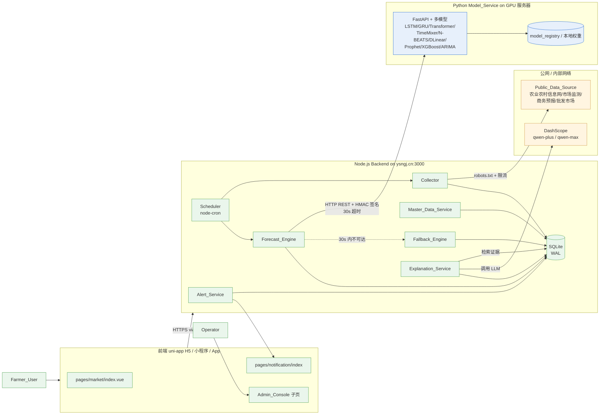
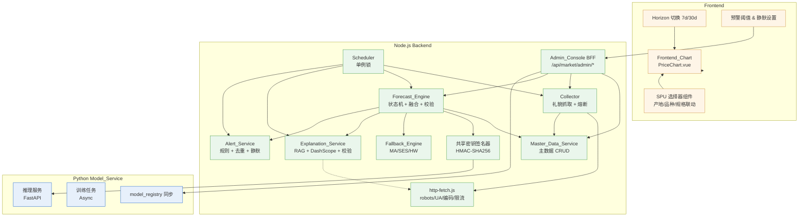
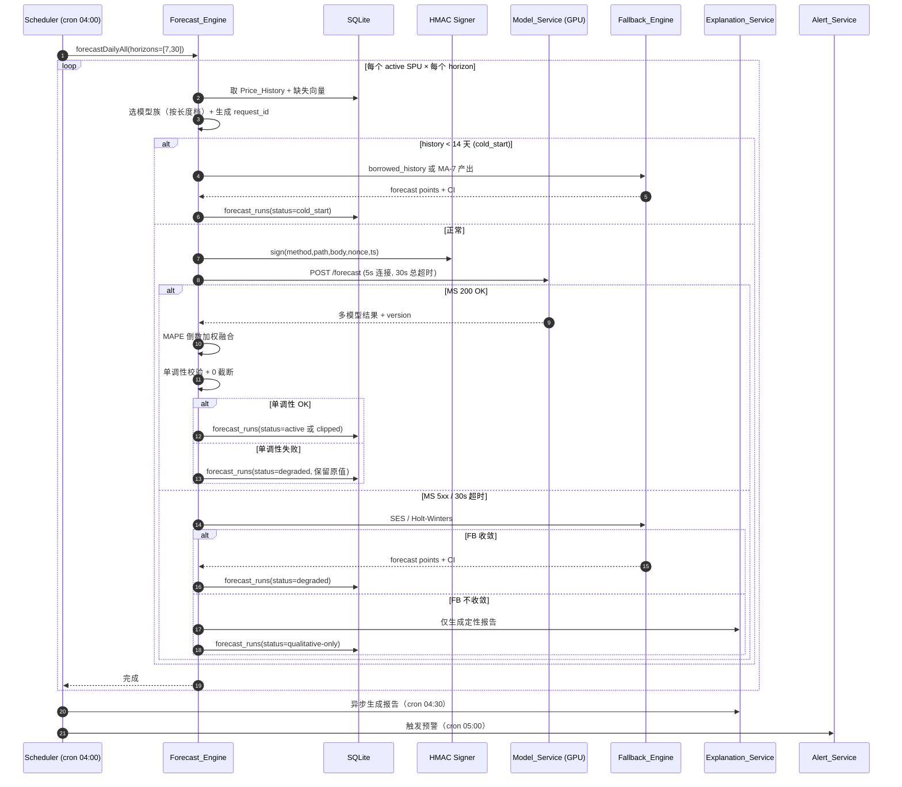
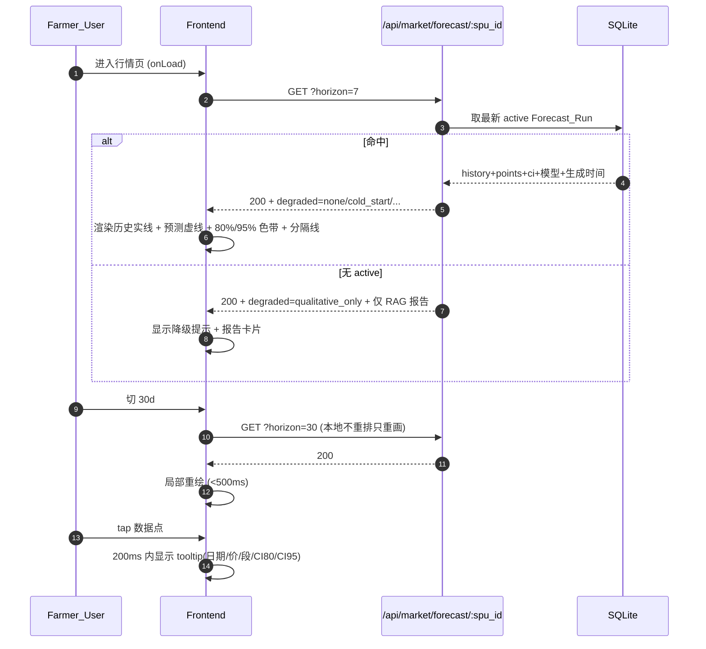
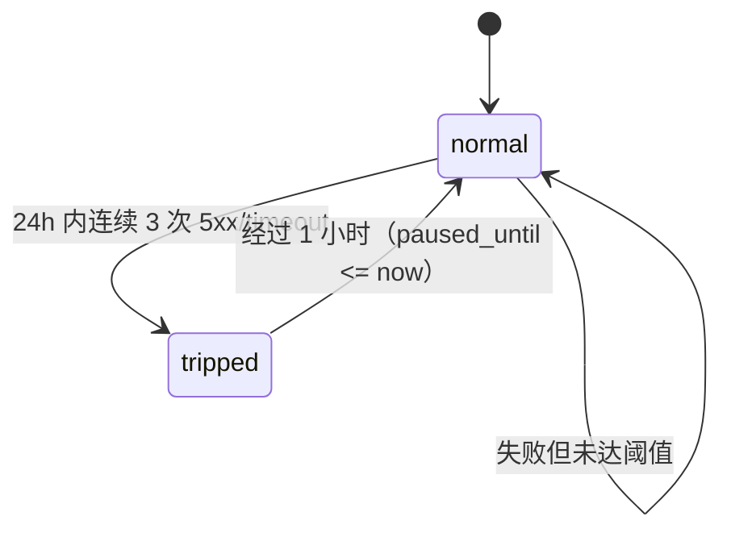
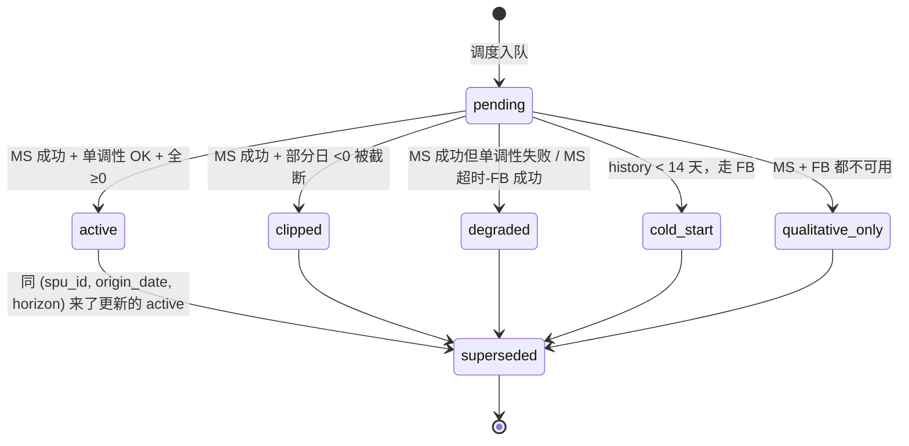
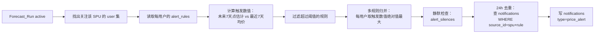
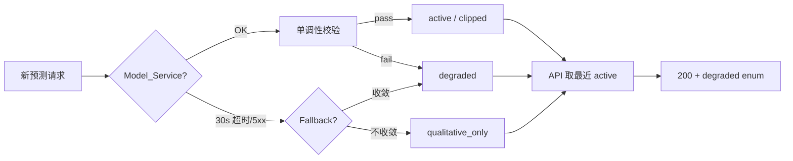

# Design Document — market-price-forecast

> 关联文档：`.kiro/specs/market-price-forecast/requirements.md`
> 代码上下文：`backend/server.js`、`backend/lib/market-rag.js`、`backend/lib/db.js`、`src/pages/market/index.vue`、`src/components/PriceChart.vue`
> 部署上下文：`deploy/nginx.conf`、`deploy/deploy.sh`（PM2 + Nginx + ysngj.cn）

---

## Overview

### 1.1 一句话价值主张

把 `pages/market/index.vue` 里那条由 `Math.random()` 拼出来的折线，换成**由公开数据驱动、由独立 GPU Model_Service 推理、由 LLM 解读、有置信区间、有降级链路**的真实预测，并把这条预测同时变成行情卡片、报告页、价格预警三处可见入口。

### 1.2 系统定位

market-price-forecast 在 AgriCloudManager 中是一个**纵向的预测能力栈**：

- 数据层：基于 Public_Data_Source 做日度采集，产出真实 `Price_History`
- 推理层：以 (产地, 品种, 规格, 单位) 四元组 SPU_Tuple 为最小预测单位，调用独立部署在 GPU 上的 Python Model_Service，运行经典统计 / ML / 深度学习多模型，产出含点估计与 80% / 95% 双置信区间的 Forecast_Run
- 表达层：复用 DashScope（`callDashScopeMessage`）+ 现有 RAG 知识库（`market_documents` / `market_chunks` / `market_chunks_fts`）把数值翻译成"为什么涨跌"的自然语言报告
- 联动层：复用现有 `notifications` 表与通知中心 UI，把预测异常波动变成 `type=price_alert` 的真实预警
- 运营层：新增 Admin_Console 子页面，让 Operator 维护 SPU 主数据、查看采集与回测、管理模型版本

### 1.3 与现有模块的边界

下面这张表锁定本 spec 与既有模块的交接面，以避免重复实现：

| 现有模块 | 本 spec 的处理方式 | 理由 |
|---|---|---|
| `market_documents` / `market_chunks` / `market_chunks_fts` | 复用，仅作为 `Explanation_Service` 的证据库 | 同一份 RAG 已经在线，不再重建第二份 |
| `market_items` | 保留，新增 `spu_id` 外键；`market_items.prediction` 字段不再人工填写，改由 `Explanation_Service` 摘要写入 | 关注列表入口已存在，避免双写 |
| `market-rag.js` 中 `searchMarketKb` / `buildFallbackMarketReport` / `saveMarketReport` | 复用 | 是 LLM 报告与降级模板的共同基础 |
| `market-rag.js` 中 `crawlAllMarketKb` 的爬虫工具集（`fetchHtml`、`sleepPolitely`、`stripTags`、`decodeBuffer`） | 抽到独立 `backend/lib/http-fetch.js`，由价格采集与知识库采集共同复用 | 复用 robots / 编码 / 限流逻辑，避免再写一遍 |
| `notifications` 表 | 复用，新增 `type='price_alert'` 取值 | UI/读写均已存在 |
| `callDashScopeMessage` | 复用 | 与 buyer / ad / market RAG 共用同一个 LLM 通道 |
| 自实现 HS256 JWT（`lib/jwt.js`）+ `requireAuth` / `optionalAuth` / `requireAdmin` | 复用 | 本 spec 不引入新鉴权方式 |
| 前端 `pages/market/index.vue` 中 `generatePriceData` / `generateComparisonData` / `createVirtualCrop` | 删除 | 这些是 mock，被本 spec 替换为真实数据驱动的实现 |

### 1.4 设计哲学

- **离线优先 + 优雅降级**：四档降级链路（Model_Service → Fallback_Engine → borrowed_history → qualitative-only）保证不出现"白板"
- **真实数据，不补 mock**：`price_history` 表只接受 Public_Data_Source 抽取出的数值，任何模型生成 / 随机生成的价格都不写入历史
- **可解释 > 可预测**：模型族标识、生成时间、置信区间、引用来源全部对外，让农户决策可信
- **写库前校验**：单调性、价格非负、报告数值在证据中可匹配，三道写入前的前置门槛
- **以四元组为最小单位**：(产地, 品种, 规格, 单位) 是合约单元，所有 API、表、内部消息以 `spu_id` 连接

---

## Architecture

### 2.1 System Context Diagram



### 2.2 Component Diagram



### 2.3 数据流序列图

#### 2.3.1 日度采集流（Daily Collection）

```mermaid
sequenceDiagram
  autonumber
  participant SCHED as Scheduler (cron 03:00)
  participant MASTER as Master_Data_Service
  participant COLL as Collector
  participant ROBOTS as robots.txt 缓存
  participant PDS as Public_Data_Source
  participant SQL as SQLite

  SCHED->>MASTER: 取所有 active SPU_Tuple
  MASTER-->>SCHED: List<SPU>
  loop 每个 SPU
    SCHED->>COLL: collectOne(spu_id, request_id)
    COLL->>ROBOTS: 查 robots(host, path)
    alt 24h 内未缓存
      COLL->>PDS: GET robots.txt (5s timeout)
      PDS-->>COLL: robots 内容 / timeout
      COLL->>ROBOTS: 写缓存
    end
    alt Disallow 或 timeout
      COLL->>SQL: collection_logs(skip, reason)
    else Allowed
      COLL->>PDS: GET 列表页 (UA 含联系邮箱, 30s timeout)
      PDS-->>COLL: HTML
      COLL->>COLL: 解析 + 抽取价格
      alt 价格非法
        COLL->>SQL: collection_logs(reject, reason, raw)
      else 价格合法
        COLL->>SQL: BEGIN; 按来源优先级合并 price_history; COMMIT
      end
    end
    COLL->>COLL: sleep(≥2000ms)
  end
  SCHED->>SQL: collection_logs 汇总
```

#### 2.3.2 Forecast_Run 主流程（含降级分支）



#### 2.3.3 用户查看预测流（Read Path）



### 2.4 模块部署位置

| 模块 | 进程 | 主机 | 进程管理 |
|---|---|---|---|
| Frontend (uni-app H5) | Nginx 静态托管 | ysngj.cn (123.58.210.188) | Nginx |
| Frontend (微信小程序 / App) | 自有运行时 | 客户端 | uni-app build 产物 |
| Scheduler / Collector / Master_Data_Service / Forecast_Engine / Fallback_Engine / Explanation_Service / Alert_Service / Admin_Console BFF | Node.js 18+，单进程多 worker（均在同一 PM2 进程 `agricloud-api`） | ysngj.cn:3000，Nginx 反代 `/api/*` | PM2 |
| Model_Service | Python 3.11 + FastAPI + Uvicorn | 独立 GPU 服务器（与 Node.js 通过内网 / VPN 互通，对公网不暴露） | systemd 或 PM2-python |
| SQLite | DatabaseSync (WAL 模式) | 与 Node.js 同机的 `backend/data/agricloud.sqlite` | 进程内 |
| 模型权重 | Model_Service 本地磁盘 + 可选 OSS 备份 | GPU 服务器 | rsync / OSS sync |

跨机部署的关键决策：

- **Model_Service 不直接暴露公网**：仅监听内网地址，Node.js backend 通过内网域名（例如 `model.internal.ysngj.cn:8000`）访问。这样 PDS 的 robots.txt、签名验证、运营审计都集中在 Node.js 这一侧。
- **SQLite 保持本机**：当前规模（5000 SPU × 365 × 2 年 ≈ 365 万行 price_history 见 §3.5）在 SQLite + WAL 上是可承受的；跨机持久化引入新依赖与一致性问题。
- **模型权重不进 Node.js 仓库**：避免 backend 部署包过大，且使 Node.js 进程不依赖任何 Python / CUDA。

### 2.5 跨服务通信协议

Node.js Backend ⇄ Model_Service：

- 协议：HTTP/1.1 + JSON（`Content-Type: application/json; charset=utf-8`）
- 内网 TLS：建议在 GPU 主机上自签证书 + Node.js 一侧 pin CA（避免明文内网泄漏，但成本可在第二阶段叠加）
- 鉴权：共享密钥 + HMAC-SHA256 请求签名（详见 §15）
- 防重放：`X-Forecast-Timestamp`（毫秒）+ `X-Forecast-Nonce`（≥16 字节随机）+ Model_Service 端 5 分钟 nonce 缓存
- request_id：Node.js 生成 KSUID 风格的 27 字符 ID（兼容长度 16-64 字符约束），透传到 Model_Service 日志、`forecast_runs.request_id`、`audit_logs`
- 超时：连接 5s、读写 30s（Requirement 3 #1, #8）；批量 `/forecast/batch` 单批最长 60s
- 错误编码：4xx 表示 Node.js 端的错误（签名失败、SPU 不存在），5xx 表示 Model_Service 端错误（模型加载失败、推理 OOM、依赖崩溃）
- 限流：Model_Service 默认每 spu_id 并发 1，全局并发 ≤ GPU 数 × 4（防 OOM，§8.7）

---

## Data Models

> 命名约定：所有表名、列名 snake_case；JSON 列以 `_json` 结尾；时间字段统一 ISO 8601 字符串（`TEXT`），与现有 `nowIso()` 风格一致。

### 3.1 主数据表

```sql
-- 产地（行政区划：到县级 6 位 GB/T 2260）
CREATE TABLE IF NOT EXISTS origins (
  id INTEGER PRIMARY KEY AUTOINCREMENT,
  adcode TEXT NOT NULL UNIQUE,           -- 6 位国标行政区划码，例如 "370613" 烟台栖霞
  province TEXT NOT NULL,
  city TEXT NOT NULL,
  county TEXT,                           -- 县级，可选；为 NULL 时表示市级及以上聚合
  display_name TEXT NOT NULL,            -- "山东烟台栖霞" 这种可读字符串
  status TEXT NOT NULL DEFAULT 'active', -- active / inactive
  created_at TEXT NOT NULL,
  updated_at TEXT NOT NULL,
  CHECK (status IN ('active','inactive')),
  CHECK (length(adcode) = 6)
);

-- 品种（含别名映射，归一化外部源命名）
CREATE TABLE IF NOT EXISTS varieties (
  id INTEGER PRIMARY KEY AUTOINCREMENT,
  code TEXT NOT NULL UNIQUE,             -- 内部稳定编码，例如 "apple-red-fuji"
  display_name TEXT NOT NULL,            -- "红富士苹果"
  category TEXT NOT NULL,                -- "fruit" / "grain" / "vegetable" / "meat" / ...
  status TEXT NOT NULL DEFAULT 'active',
  created_at TEXT NOT NULL,
  updated_at TEXT NOT NULL,
  CHECK (status IN ('active','inactive'))
);

-- 品种别名表（外部数据源的命名 → varieties.code）
CREATE TABLE IF NOT EXISTS variety_aliases (
  id INTEGER PRIMARY KEY AUTOINCREMENT,
  variety_id INTEGER NOT NULL,
  source_name TEXT NOT NULL,             -- "moa" / "agri-cn" / "mofcom" / "pfsc" / "manual"
  alias TEXT NOT NULL,                   -- "白菜" / "大白菜" / "Apple"
  created_at TEXT NOT NULL,
  UNIQUE(source_name, alias),
  FOREIGN KEY (variety_id) REFERENCES varieties(id) ON DELETE CASCADE
);

-- 规格（参考国家果蔬分级标准；不同 category 含义不同，所以不限制取值）
CREATE TABLE IF NOT EXISTS grades (
  id INTEGER PRIMARY KEY AUTOINCREMENT,
  code TEXT NOT NULL UNIQUE,             -- 内部稳定编码，例如 "fruit-grade-1-80mm"
  display_name TEXT NOT NULL,            -- "一级 80mm 以上"
  category TEXT NOT NULL,                -- 与 varieties.category 取值集合相同
  status TEXT NOT NULL DEFAULT 'active',
  created_at TEXT NOT NULL,
  updated_at TEXT NOT NULL,
  CHECK (status IN ('active','inactive'))
);

-- 计量单位（统一存元/公斤；前端可换算元/斤）
CREATE TABLE IF NOT EXISTS units (
  id INTEGER PRIMARY KEY AUTOINCREMENT,
  code TEXT NOT NULL UNIQUE,             -- "CNY/kg"
  display_name TEXT NOT NULL,            -- "元/公斤"
  base_unit TEXT NOT NULL DEFAULT 'CNY/kg', -- 用于换算的基准单位
  conversion_factor REAL NOT NULL DEFAULT 1.0, -- 此单位 → 基准单位的乘数
  status TEXT NOT NULL DEFAULT 'active',
  created_at TEXT NOT NULL,
  updated_at TEXT NOT NULL,
  CHECK (status IN ('active','inactive'))
);

-- SPU 四元组：(产地, 品种, 规格, 单位)
CREATE TABLE IF NOT EXISTS spu_tuples (
  spu_id TEXT PRIMARY KEY,               -- KSUID 27 字符；创建后不可修改（Requirement 2 #2）
  origin_id INTEGER NOT NULL,
  variety_id INTEGER NOT NULL,
  grade_id INTEGER NOT NULL,
  unit_id INTEGER NOT NULL,
  status TEXT NOT NULL DEFAULT 'active',
  display_name TEXT NOT NULL,            -- 拼接后的中文长名："山东烟台栖霞 红富士苹果 一级80mm以上 元/公斤"
  created_at TEXT NOT NULL,
  updated_at TEXT NOT NULL,
  UNIQUE(origin_id, variety_id, grade_id, unit_id),
  FOREIGN KEY (origin_id) REFERENCES origins(id),
  FOREIGN KEY (variety_id) REFERENCES varieties(id),
  FOREIGN KEY (grade_id) REFERENCES grades(id),
  FOREIGN KEY (unit_id) REFERENCES units(id),
  CHECK (status IN ('active','inactive'))
);

CREATE INDEX IF NOT EXISTS idx_spu_status ON spu_tuples(status);
CREATE INDEX IF NOT EXISTS idx_spu_variety ON spu_tuples(variety_id);
```

> **spu_id 选 KSUID 而非自增**的理由：跨服务（Node.js ↔ Model_Service ↔ 日志）使用，自增 ID 在导入导出 / 多环境时容易冲突；KSUID 同时保留时间排序属性，便于按创建时间排序。`UNIQUE(origin_id, variety_id, grade_id, unit_id)` 同时覆盖 active 与 inactive，因此即使把一条 inactive 化也不允许后来再创建一条同四元组（Requirement 2 #4 要求"无论 status"）。

### 3.2 价格历史与采集日志

```sql
-- 日频价格序列（每条对应 SPU + 日期 + 价格）
CREATE TABLE IF NOT EXISTS price_history (
  id INTEGER PRIMARY KEY AUTOINCREMENT,
  spu_id TEXT NOT NULL,
  observed_date TEXT NOT NULL,            -- "YYYY-MM-DD"，Asia/Shanghai 自然日
  price REAL,                             -- null 表示该日缺失（需结合 missing_reason）
  source_name TEXT NOT NULL,              -- "moa" / "agri-cn" / "mofcom" / "pfsc"
  source_url TEXT NOT NULL,
  source_priority INTEGER NOT NULL,       -- 1=moa, 2=pfsc, 3=mofcom, 4=agri-cn
  raw_text TEXT,                          -- 原始价格文本，便于审计
  missing_reason TEXT,                    -- holiday / market_closed / collection_failed / unknown / null
  collected_at TEXT NOT NULL,             -- 采集时间戳 ISO 8601
  request_id TEXT NOT NULL,
  UNIQUE(spu_id, observed_date),
  FOREIGN KEY (spu_id) REFERENCES spu_tuples(spu_id) ON DELETE CASCADE,
  CHECK (price IS NULL OR (price > 0 AND price <= 1000000)),
  CHECK (missing_reason IS NULL OR missing_reason IN ('holiday','market_closed','collection_failed','unknown'))
);

CREATE INDEX IF NOT EXISTS idx_price_history_spu_date
  ON price_history(spu_id, observed_date DESC);

-- 采集日志（接受 / 拒绝 / 跳过 / 熔断 全在这里）
CREATE TABLE IF NOT EXISTS collection_logs (
  id INTEGER PRIMARY KEY AUTOINCREMENT,
  request_id TEXT NOT NULL,
  spu_id TEXT,                            -- 跳过 robots / 熔断时可为 NULL
  source_name TEXT NOT NULL,
  source_url TEXT,
  status TEXT NOT NULL,                   -- success / rejected / skipped / circuit_break / failed
  http_status INTEGER,
  duration_ms INTEGER,
  reason TEXT,                            -- 文本说明
  raw_text TEXT,                          -- rejected 时保留原始字串
  triggered_by TEXT NOT NULL DEFAULT 'scheduler', -- scheduler / admin_manual
  triggered_user_id INTEGER,
  created_at TEXT NOT NULL,
  CHECK (status IN ('success','rejected','skipped','circuit_break','failed'))
);

CREATE INDEX IF NOT EXISTS idx_collection_logs_created ON collection_logs(created_at DESC);
CREATE INDEX IF NOT EXISTS idx_collection_logs_spu ON collection_logs(spu_id, created_at DESC);
CREATE INDEX IF NOT EXISTS idx_collection_logs_source ON collection_logs(source_name, created_at DESC);
```

> `UNIQUE(spu_id, observed_date)` 表达"一个 SPU 同一天只保留一条 price_history" 的契约。来源优先级合并发生在 INSERT OR REPLACE 之前的应用层（按 `source_priority` 比较），保留原 `collected_at` 与 `source_url` 等审计字段做合并而不是覆盖（Requirement 1 #5）。`raw_text` 在拒绝时也保留，对应 Requirement 1 #6 "记录拒绝原因、原始来源 URL 与原始价格文本"。

### 3.3 预测产出表

```sql
-- 一次预测产出（含融合后结果）
CREATE TABLE IF NOT EXISTS forecast_runs (
  id INTEGER PRIMARY KEY AUTOINCREMENT,
  request_id TEXT NOT NULL,
  spu_id TEXT NOT NULL,
  origin_date TEXT NOT NULL,              -- 预测起算日 "YYYY-MM-DD"
  horizon_days INTEGER NOT NULL,          -- 7 或 30
  status TEXT NOT NULL,                   -- active / superseded / degraded / cold_start / clipped / qualitative-only
  model_families_json TEXT NOT NULL,      -- JSON 数组，例如 ["lstm","arima","prophet"]
  weights_json TEXT NOT NULL DEFAULT '{}',-- JSON 字典：{"lstm":0.5,"arima":0.3,"prophet":0.2}
  point_estimates_json TEXT NOT NULL,     -- 长度=horizon_days 的 number/null 数组
  ci80_lower_json TEXT NOT NULL,
  ci80_upper_json TEXT NOT NULL,
  ci95_lower_json TEXT NOT NULL,
  ci95_upper_json TEXT NOT NULL,
  borrowed_history_flag INTEGER NOT NULL DEFAULT 0, -- 0/1，是否使用了同品种借数
  borrowed_origin_ids_json TEXT NOT NULL DEFAULT '[]',
  explanation TEXT,                       -- LLM 生成的完整报告，写入前需通过校验
  explanation_summary TEXT,               -- ≤80 汉字摘要（同步进 market_items.prediction）
  generated_at TEXT NOT NULL,
  inference_ms INTEGER,                   -- Model_Service 推理耗时
  shadow_of_run_id INTEGER,               -- 影子模式的"伴生" forecast_run（产线版本的 id）
  FOREIGN KEY (spu_id) REFERENCES spu_tuples(spu_id) ON DELETE CASCADE,
  CHECK (horizon_days IN (7, 30)),
  CHECK (status IN ('active','superseded','degraded','cold_start','clipped','qualitative-only'))
);

CREATE INDEX IF NOT EXISTS idx_forecast_runs_spu_active
  ON forecast_runs(spu_id, horizon_days, status, generated_at DESC);
CREATE INDEX IF NOT EXISTS idx_forecast_runs_origin_date
  ON forecast_runs(spu_id, origin_date, horizon_days);

-- 单模型独立结果（便于回测与影子模式诊断）
CREATE TABLE IF NOT EXISTS forecast_run_models (
  id INTEGER PRIMARY KEY AUTOINCREMENT,
  forecast_run_id INTEGER NOT NULL,
  model_family TEXT NOT NULL,             -- "lstm" / "arima" / ...
  model_version TEXT NOT NULL,
  status TEXT NOT NULL DEFAULT 'success', -- success / failed / shadow
  weight REAL NOT NULL DEFAULT 0,         -- 在融合中的权重；shadow 时为 0
  point_estimates_json TEXT NOT NULL,
  ci80_lower_json TEXT NOT NULL,
  ci80_upper_json TEXT NOT NULL,
  ci95_lower_json TEXT NOT NULL,
  ci95_upper_json TEXT NOT NULL,
  inference_ms INTEGER,
  error_message TEXT,
  created_at TEXT NOT NULL,
  FOREIGN KEY (forecast_run_id) REFERENCES forecast_runs(id) ON DELETE CASCADE,
  CHECK (status IN ('success','failed','shadow'))
);

CREATE INDEX IF NOT EXISTS idx_forecast_run_models_run ON forecast_run_models(forecast_run_id);
```

> 把"每个模型的独立结果"放在子表（`forecast_run_models`）有两个理由：
> (1) Requirement 3 #7 要求保留每个模型独立结果；
> (2) 影子模型（Requirement 10）需要写入但不参与对外，权重 0 即可表达，不污染主表的语义。
>
> JSON 列存储置信区间序列优于宽表（90 列）：未来扩展 horizon 或新增 CI50 都不需要改表（满足非功能需求 #4 可扩展性）。代价是 SQLite 不能在这些列上直接做 SQL 范围查询，但本 spec 的查询模式都是 `WHERE spu_id=? AND horizon=? AND status='active'` 取一行后整体读取，不依赖在 JSON 内部过滤。

### 3.4 回测、模型注册、预警、审计、冷启动队列

```sql
-- 回测结果
CREATE TABLE IF NOT EXISTS backtest_results (
  id INTEGER PRIMARY KEY AUTOINCREMENT,
  spu_id TEXT NOT NULL,
  model_family TEXT NOT NULL,
  model_version TEXT NOT NULL,
  horizon_days INTEGER NOT NULL,
  window_start TEXT NOT NULL,             -- 测试集起点
  window_end TEXT NOT NULL,               -- 测试集结束
  mape REAL,                              -- 0-1，越低越好
  rmse REAL,
  directional_accuracy REAL,              -- 0-1
  status TEXT NOT NULL DEFAULT 'ok',      -- ok / auto-disabled / insufficient-data / failed
  reason TEXT,
  created_at TEXT NOT NULL,
  FOREIGN KEY (spu_id) REFERENCES spu_tuples(spu_id) ON DELETE CASCADE,
  CHECK (status IN ('ok','auto-disabled','insufficient-data','failed')),
  CHECK (horizon_days IN (7, 30))
);

CREATE INDEX IF NOT EXISTS idx_backtest_spu_model ON backtest_results(spu_id, model_family, created_at DESC);

-- 模型注册（model_family + version + status 三元组）
CREATE TABLE IF NOT EXISTS model_registry (
  id INTEGER PRIMARY KEY AUTOINCREMENT,
  model_family TEXT NOT NULL,
  version TEXT NOT NULL,                   -- ≤64 chars
  status TEXT NOT NULL DEFAULT 'shadow',   -- shadow / canary / production / retired
  canary_percentage INTEGER NOT NULL DEFAULT 0, -- 1-50（仅 canary 有效）
  artifact_path TEXT NOT NULL,             -- Model_Service 本地路径或 OSS URI
  notes TEXT,
  created_at TEXT NOT NULL,
  updated_at TEXT NOT NULL,
  UNIQUE(model_family, version),
  CHECK (length(version) <= 64),
  CHECK (status IN ('shadow','canary','production','retired')),
  CHECK (canary_percentage BETWEEN 0 AND 50)
);

-- 同一 family 至多 1 个 production：通过部分唯一索引在 SQLite 上强约束
CREATE UNIQUE INDEX IF NOT EXISTS uq_model_registry_one_prod_per_family
  ON model_registry(model_family) WHERE status = 'production';

-- 用户预警阈值
CREATE TABLE IF NOT EXISTS alert_rules (
  id INTEGER PRIMARY KEY AUTOINCREMENT,
  user_id INTEGER NOT NULL,
  spu_id TEXT NOT NULL,
  rule_type TEXT NOT NULL,                 -- price_up / price_down / volatility_high
  threshold REAL NOT NULL,                 -- 1-50 (%) for price_up/down；50 (%) 默认 for volatility
  enabled INTEGER NOT NULL DEFAULT 1,
  created_at TEXT NOT NULL,
  updated_at TEXT NOT NULL,
  UNIQUE(user_id, spu_id, rule_type),
  FOREIGN KEY (user_id) REFERENCES users(id) ON DELETE CASCADE,
  FOREIGN KEY (spu_id) REFERENCES spu_tuples(spu_id) ON DELETE CASCADE,
  CHECK (rule_type IN ('price_up','price_down','volatility_high')),
  CHECK (threshold BETWEEN 1 AND 50)
);

-- 用户预警静默
CREATE TABLE IF NOT EXISTS alert_silences (
  id INTEGER PRIMARY KEY AUTOINCREMENT,
  user_id INTEGER NOT NULL,
  spu_id TEXT NOT NULL,
  silence_until TEXT,                      -- null=永久静默；否则 ISO 时间
  created_at TEXT NOT NULL,
  UNIQUE(user_id, spu_id),
  FOREIGN KEY (user_id) REFERENCES users(id) ON DELETE CASCADE,
  FOREIGN KEY (spu_id) REFERENCES spu_tuples(spu_id) ON DELETE CASCADE
);

-- 审计日志（合规 + 操作可追溯）
CREATE TABLE IF NOT EXISTS audit_logs (
  id INTEGER PRIMARY KEY AUTOINCREMENT,
  actor_id INTEGER,                        -- Operator user_id，系统行为可空
  actor_role TEXT NOT NULL,                -- operator / system / scheduler
  action TEXT NOT NULL,                    -- spu.create / spu.deactivate / model.promote / collection.manual / data.delete / source.deactivate / sensitive.access
  target_type TEXT NOT NULL,               -- spu / origin / variety / grade / unit / model / source / user_data
  target_id TEXT,                          -- 文本以兼容 spu_id (KSUID) 或数字
  payload_json TEXT NOT NULL DEFAULT '{}', -- 详细差异
  request_id TEXT,
  ip TEXT,
  created_at TEXT NOT NULL
);

CREATE INDEX IF NOT EXISTS idx_audit_actor ON audit_logs(actor_id, created_at DESC);
CREATE INDEX IF NOT EXISTS idx_audit_target ON audit_logs(target_type, target_id, created_at DESC);

-- 冷启动 / 历史回填任务队列
CREATE TABLE IF NOT EXISTS cold_start_jobs (
  id INTEGER PRIMARY KEY AUTOINCREMENT,
  spu_id TEXT NOT NULL,
  status TEXT NOT NULL DEFAULT 'queued',   -- queued / running / done / failed / timeout
  enqueued_at TEXT NOT NULL,
  started_at TEXT,
  finished_at TEXT,
  attempt_count INTEGER NOT NULL DEFAULT 0,
  reason TEXT,
  request_id TEXT NOT NULL,
  FOREIGN KEY (spu_id) REFERENCES spu_tuples(spu_id) ON DELETE CASCADE,
  CHECK (status IN ('queued','running','done','failed','timeout'))
);

CREATE INDEX IF NOT EXISTS idx_cold_start_status ON cold_start_jobs(status, enqueued_at);

-- robots.txt 缓存（每个域名 24h）
CREATE TABLE IF NOT EXISTS robots_cache (
  host TEXT PRIMARY KEY,
  raw_text TEXT NOT NULL,
  fetched_at TEXT NOT NULL,
  expires_at TEXT NOT NULL
);

-- 来源熔断状态
CREATE TABLE IF NOT EXISTS source_circuit_breaker (
  source_name TEXT PRIMARY KEY,
  failure_count INTEGER NOT NULL DEFAULT 0,
  window_started_at TEXT NOT NULL,         -- 24h 滚动窗口起点
  paused_until TEXT,                       -- 命中熔断后暂停截止时间
  updated_at TEXT NOT NULL
);
```

### 3.5 与现有表的外键 / 字段衔接

```sql
-- 现有 market_items 增加 spu_id 字段（保留 name 做兼容）
ALTER TABLE market_items ADD COLUMN spu_id TEXT REFERENCES spu_tuples(spu_id);
CREATE INDEX IF NOT EXISTS idx_market_items_spu ON market_items(spu_id);

-- 现有 notifications.type 增加 'price_alert' 取值（无需 ALTER，TEXT 列直接接受新字符串）
-- 应用层在写入处校验 type ∈ {'price','buyer','task','system','price_alert'}
-- linkPayload JSON 在 price_alert 时形如：
--   { "spu_id": "ksuid...", "forecast_run_id": 12345, "rule_type": "price_down", "threshold": 5, "trigger_value": -7.2 }
```

迁移策略详见 §18。

### 3.6 索引与查询模式映射

| 高频查询 | 索引 | 复杂度 |
|---|---|---|
| 列表 active SPU | `idx_spu_status` | O(N_active) |
| 取某 SPU 最近 N 天历史 | `idx_price_history_spu_date` (spu_id, observed_date DESC) | O(log + N) |
| 取某 SPU + horizon 的 active forecast_run | `idx_forecast_runs_spu_active` | O(log + 1) |
| 看某 SPU 的回测趋势 | `idx_backtest_spu_model` | O(log + N) |
| 处理冷启动队列 | `idx_cold_start_status` | O(N_queued) |
| 用户审计追踪 | `idx_audit_actor` | O(log + N) |

### 3.7 SQLite 容量与扩展性

按目标规模估算：

- 5000 SPU × 365 天 × 2 年 ≈ **3.65 × 10⁶ 行 price_history**
- 每行 ≈ 200 字节（含 raw_text 短文本），总 ≈ 730 MB；加索引约 1 GB
- WAL 模式下并发读 + 单写在每秒数百次写入仍稳定（参考 SQLite 官方 WAL 性能基准）

风险点：

- forecast_runs 累积量较小（5000 SPU × 2 horizons × 1 次/天 × 2 年 ≈ 730 万行，但 active+ superseded 共存）
- `audit_logs` 长期增长，需要按月归档脚本

迁移预留：

- 所有时间字段 TEXT ISO 8601、JSON 列存储数组——这些都是 PostgreSQL 友好的；future 迁移仅需 schema migration + JSONB 类型替换
- 抽象 `lib/db.js` 为 query interface，从 `db.prepare(...).all()` 过渡到 ORM（如 Drizzle）成本可控
- 价格表按月分区脚本：保留接口 `archive_price_history(year, month)`，运营每年初执行一次 export → S3/OSS 后 DELETE，降低主库体积

---

## Components and Interfaces

> 本节详细展开 §2.2 Component Diagram 中的 8 大子模块（Master_Data_Service / Collector / Forecast_Engine / Model_Service / Fallback_Engine / Explanation_Service / Alert_Service / Frontend），以及配套的 Scheduler、API、安全、Observability 设计。

## 4. Master Data 设计（产地·品种·规格·单位）

### 4.1 产地行政区划编码

复用国标 GB/T 2260 行政区划码到县级 6 位（前 2 省、3-4 市、5-6 县）。

**为什么不自创编码**：现有 `weather_cache.adcode` 已经是高德 adcode（与 GB/T 2260 兼容），统一编码可让产地 ⇄ 天气查询直接关联。

**示例**：

| adcode | province | city | county | display_name |
|---|---|---|---|---|
| 370613 | 山东省 | 烟台市 | 栖霞市 | 山东烟台栖霞 |
| 410100 | 河南省 | 郑州市 | NULL | 河南郑州（市级聚合） |
| 130000 | 河北省 | NULL | NULL | 河北全省 |

### 4.2 品种命名归一化

外部数据源命名混乱（"白菜" vs "大白菜"，"苹果" vs "红富士苹果"），统一以**内部 code → display_name** 为准，外部别名进入 `variety_aliases`。

| 内部 code | display_name | 别名（source_name → alias） |
|---|---|---|
| `apple-red-fuji` | 红富士苹果 | moa→苹果, agri-cn→红富士, mofcom→苹果(红富士) |
| `soybean-yellow` | 黄大豆 | moa→大豆, agri-cn→黄豆, mofcom→大豆 |
| `corn-yellow` | 黄玉米 | moa→玉米, agri-cn→玉米, pfsc→玉米 |
| `cabbage-chinese` | 大白菜 | moa→白菜, agri-cn→大白菜, mofcom→大白菜 |

归一化函数定义：

```ts
// backend/lib/master-alias.js
function normalizeVariety(sourceName: string, externalAlias: string): string | null {
  // 查 variety_aliases，找不到返回 null（让 Collector 把这条价格丢进 collection_logs.skipped 并记录 reason='unknown_alias'）
}
```

> **处理未识别别名**：不自动创建新 variety；让 Operator 在 Admin_Console 的 collection_logs 视图中看到 reason='unknown_alias' 的样本，再决定是新建 variety、加别名还是忽略。这样避免品种表被脏数据污染。

### 4.3 规格分级

参考 GB/T 10651（鲜苹果）、GB/T 8868（蔬菜分级通则）等国家标准：

- 苹果：一级（80mm 及以上）、二级（70-79mm）、三级（65-69mm）、统货
- 大豆：纯粮率分级（含杂、纯粮率 ≥ 99% 等）
- 蔬菜：A 级 / B 级 / C 级 / 统货

**当前 spec 范围内**只接入苹果 / 大豆 / 玉米，每个 category 至少录入"统货"作为兜底，保证有 SPU 可建。

### 4.4 单位归一化

统一以 `元/公斤`（CNY/kg）为基准存储；`units.conversion_factor` 提供其他单位 → 基准的乘数：

| code | display_name | conversion_factor |
|---|---|---|
| CNY/kg | 元/公斤 | 1.0 |
| CNY/jin | 元/斤 | 2.0 (1 公斤 = 2 斤，所以"元/斤" 数值 = "元/公斤" × 0.5；conversion_factor 表达 1 jin = 0.5 kg 的换算系数) |

**前端展示**根据用户偏好换算（默认元/斤），但 API 与 SQLite 存储统一 CNY/kg（Requirement 4 #2）。

### 4.5 数据初始化（Seed）

随迁移脚本一并写入：

- origins：370613（山东烟台栖霞）、410882（河南灵宝，苹果产地）、150400（内蒙古赤峰，大豆/玉米产地）
- varieties：apple-red-fuji、soybean-yellow、corn-yellow（含别名）
- grades：fruit-grade-1、fruit-grade-2、grain-grade-standard
- units：CNY/kg、CNY/jin
- spu_tuples（首批，与现有 market_items 中的"苹果/大豆/玉米"对齐）：
  - SPU#1：山东烟台栖霞 + 红富士苹果 + 一级 + CNY/kg（默认主灰度对象）
  - SPU#2：内蒙古赤峰 + 黄大豆 + 统货 + CNY/kg
  - SPU#3：内蒙古赤峰 + 黄玉米 + 统货 + CNY/kg

> 当前 `market_items` 表的"苹果/大豆/玉米"通过 `name` 字段松散对应；迁移脚本会把这三行 `market_items.spu_id` 回填到上述 SPU。

---

## 5. Collector 设计

### 5.1 复用还是新建

**新建** `backend/lib/price-collector.js`，但把现有 `market-rag.js` 中的通用工具（`fetchHtml`、`sleepPolitely`、`stripTags`、`decodeBuffer`、`detectEncoding`）抽到 `backend/lib/http-fetch.js`，**让价格采集与知识库采集共享同一套礼貌抓取层**。

理由：

- `market-rag.js` 的逻辑面向 RAG 文档（标题 + 段落 + 时间），不直接产出 (SPU, 日期, 价格) 三元组——重复这些工具有维护成本但语义不重叠
- 把礼貌抓取层抽出来后，robots.txt / UA / 编码探测 / 礼貌间隔在两边表现一致

### 5.2 robots.txt 解析与缓存

```ts
// backend/lib/robots-cache.js
async function isAllowed(host: string, path: string, ua: string): Promise<{
  allowed: boolean
  reason: 'allow' | 'disallow' | 'timeout' | 'fetch_error'
}> {
  const cached = readRobotsCache(host)
  if (cached && cached.expires_at > now) {
    return parseRobotsAndCheck(cached.raw_text, path, ua)
  }
  const text = await fetchRobotsWithTimeout(host, 5000)  // Requirement 1 #10: 5s timeout
  if (text === '__TIMEOUT__') return { allowed: false, reason: 'timeout' }
  writeRobotsCache(host, text, ttlHours = 24)
  return parseRobotsAndCheck(text, path, ua)
}
```

> 选择"24h 缓存"在合规与性能间取平衡：robots.txt 通常不频繁变更，但 24h 内若来源新增 Disallow，最坏只多采集一天，运营在 Admin_Console 也能手动失效缓存。

robots.txt 解析使用现成 `robots-parser` npm 库（< 50KB）；不引入更重的依赖。

### 5.3 各来源采集策略

| 来源 | 策略 | 数据形态 | 备注 |
|---|---|---|---|
| 农业农村部市场监测（scs.moa.gov.cn） | HTML 列表 + 文章解析 | 周报、月报中的批发价格 200 指数与单品价格段落 | source_priority=1（最高） |
| 全国农产品批发市场价格信息系统（pfsc.agri.cn） | HTML 表格直采 | 日度品种 × 市场价格表 | source_priority=2；最贴近"日频价格" |
| 商务部商务预报（cif.mofcom.gov.cn） | HTML 列表 + 周报 | 周度食用农产品价格指数 | source_priority=3 |
| 中国农业农村信息网（agri.cn） | HTML 列表 + 文章解析 | 月度数据评论 | source_priority=4；偏综述，价格散落在正文 |

**目标 URL 模式**复用 `market-rag.js` 的 `SEED_SOURCES` 与 `TARGETED_ARTICLE_SOURCES` 列表，但价格抽取规则独立：

```ts
// backend/lib/price-extractor.js
// 输入：文章 HTML（已解码 + decodeHtmlEntities）+ SPU_Tuple
// 输出：{ price: number, observed_date: string, source_url: string } 或 null
function extractPrice(html: string, spu: SPU): { price: number, observed_date: string } | null {
  // 步骤 1: DOM/正则定位包含品种名（含别名）的段落
  // 步骤 2: 在品种名 ±100 字符窗口里匹配 (\d+(?:\.\d+)?)\s*元\s*/\s*(公斤|斤)
  // 步骤 3: 单位归一化到 元/公斤
  // 步骤 4: 提取发布日期作为 observed_date（找不到则用上下文推断）
  // 步骤 5: 返回（或 null）
}
```

每个来源单独的 `extractor`（`extractor.moa.js`、`extractor.pfsc.js` 等）实现统一接口，便于未来加新来源或为单一来源做精细化解析。

### 5.4 来源优先级合并

每天采集结束后，对同一 (spu_id, observed_date) 多源数据合并：

```ts
function mergePrice(existing: PriceRow | null, candidate: PriceRow): MergeAction {
  if (!existing) return { action: 'insert', row: candidate }
  // source_priority 越小越高
  if (candidate.source_priority < existing.source_priority) {
    return { action: 'replace', row: candidate, preserve: ['collected_at', 'source_url', 'source_name'] }  // Requirement 1 #5: 保留审计字段
  }
  return { action: 'skip', reason: 'lower_priority' }
}
```

> Requirement 1 #5 要求"保留该记录原有的来源标识、来源 URL 与采集时间戳等审计字段"——理解为：以更高优先级的**价格数值**覆盖原值，但要保留原审计信息。实现上把"原审计"以 JSON 形式追加到 `raw_text` 字段或单独 `previous_source_json` 列；这里用 `raw_text` 拼接 "PREV:..."，避免新增列。

### 5.5 限流与熔断

- **每域名并发上限 1**：用一个进程内 Map<host, Promise> 排队，确保任何时刻同一域名最多 1 个 in-flight 请求
- **礼貌间隔 ≥ 2000ms**：复用 `sleepPolitely` 的 1200-2500ms 随机化（已 ≥ 2000ms 上限，为符合 Requirement 1 #3 强制把下限提至 2000ms）
- **单请求超时 30s**（Requirement 1 #11），robots.txt 5s（Requirement 1 #10）
- **熔断器**：`source_circuit_breaker` 表持久化失败计数。状态机：



熔断触发时：写 `collection_logs(status='circuit_break')` 并跳过当次采集（Requirement 1 #9）。

### 5.6 任务调度选型

**选 `node-cron`** 而非 `setInterval`：

| 维度 | node-cron | setInterval |
|---|---|---|
| 表达 03:00 这种点位 | ✅ `0 3 * * *` 直白 | ❌ 需要算下次触发的 ms |
| 进程重启对齐 | ✅ 重启后下个时刻自然触发 | ❌ 需要持久化"上次触发时间" |
| 时区 | ✅ `timezone: 'Asia/Shanghai'` | ❌ 自己处理 |
| 包体积 | ~30KB | 0 |

依赖体积 < 1MB 可接受；与 Requirement 8 #3 的 Fallback_Engine 限制不冲突（限制对象是 Fallback_Engine 自己，不是 Scheduler）。

### 5.7 失败重试

- 单 SPU 单 URL 失败：指数退避 `delay_i = min(60s, 2 * 2^i + jitter)`，最多 3 次
- 同一 SPU 当天最终失败：写 `collection_logs(status='failed')`，**不阻塞其他 SPU**（Requirement 1 #8）
- 当天结束仍缺失：`price_history(price=NULL, missing_reason='collection_failed')`

---

## 6. Master_Data_Service 设计

### 6.1 路由（详细在 §12）

- `GET/POST/PUT/DELETE /api/market/admin/master/origins`
- `GET/POST/PUT/DELETE /api/market/admin/master/varieties`（含 `aliases` 子资源）
- `GET/POST/PUT/DELETE /api/market/admin/master/grades`
- `GET/POST/PUT/DELETE /api/market/admin/master/units`
- `GET/POST/PUT/PATCH /api/market/admin/master/spu-tuples`（PATCH 仅允许改 status）

### 6.2 主数据 CRUD 与级联校验

写操作统一在事务内完成（避免 status 与子表的中间不一致）：

```ts
db.exec('BEGIN IMMEDIATE')
try {
  // 1) 校验外键存在 + status='active'（Requirement 2 #3）
  // 2) 校验唯一性（active + inactive 都查；Requirement 2 #4）
  // 3) 生成 KSUID 作为 spu_id
  // 4) 写 spu_tuples
  // 5) 写 audit_logs(action='spu.create')
  db.exec('COMMIT')
} catch (e) {
  db.exec('ROLLBACK')
  throw e
}
```

### 6.3 状态切换 → Scheduler 的级联

- `spu_tuples.status: active → inactive`：由应用层把该 SPU 的 spu_id 写进 Scheduler 的"排除集"内存缓存（每次任务起始重读 active 列表，自然生效）
- 历史 price_history / forecast_runs 不删除（Requirement 2 #6）

### 6.4 别名归一化服务

```ts
// backend/lib/master-alias.js
async function resolveSpuFromExternalRecord(
  sourceName: 'moa' | 'agri-cn' | 'mofcom' | 'pfsc',
  externalVariety: string,
  externalGrade: string | null,
  externalOriginText: string | null
): Promise<string | null> // 返回 spu_id，找不到返回 null
```

策略：

1. variety: 查 `variety_aliases(source_name, alias)` → variety_id
2. grade: 没有 grade 时取该 variety 的"统货"
3. origin: 文本匹配 origins.display_name；找不到时回退到省级聚合 origin
4. unit: 默认 CNY/kg
5. 通过四元组反查 spu_tuples（status='active'）

**找不到时返回 null** 让 Collector 写 `collection_logs(reason='unknown_alias' / 'unknown_grade' / 'unknown_origin', raw_text=外部原文)`，Operator 在后台审阅后扩展别名表。

---

## 7. Forecast_Engine 设计（核心）

### 7.1 调度器

| Cron | 任务 | 作用 |
|---|---|---|
| `30 2 * * *` Asia/Shanghai | robots.txt 缓存刷新（按需） | 提前拉取，避免下一步采集时 5s 等待 |
| `0 3 * * *` | 日度采集 | Collector |
| `0 4 * * *` | 日度预测（7d + 30d） | Forecast_Engine |
| `30 4 * * *` | LLM 报告生成（异步） | Explanation_Service |
| `0 5 * * *` | 价格预警 | Alert_Service |
| `0 2 * * 1` | 周度回测 | Forecast_Engine |
| `0 * * * *` | 冷启动队列扫描 | Forecast_Engine |

### 7.2 Forecast_Run 状态机



**只有** `active` / `clipped` / `cold_start` / `qualitative_only` 会被 `/api/market/forecast/:spu_id` 当前响应使用（取最近 1 条）；`degraded` 表示数值校验未过的版本，仅供回测使用，**不对外**（Requirement 4 #4）。

### 7.3 模型族选择算法

```ts
function selectFamilies(historyLen: number, registry: ModelRegistry[]): string[] {
  if (historyLen < 14)            return ['moving_average']                             // cold_start, FB 处理
  if (historyLen < 60)            return ['moving_average', 'simple_exp_smoothing']     // FB 处理（Requirement 3 #5 范围扩展）
  if (historyLen < 365)           return registry.filter(m => m.kind === 'statistical').map(m => m.family)  // ARIMA + Prophet + HW + ...（≥2 个，Requirement 3 #11）
  /* historyLen ≥ 365 */         return [
    ...registry.filter(m => m.kind === 'statistical').slice(0, 2).map(m => m.family),
    ...registry.filter(m => m.kind === 'deep').slice(0, 2).map(m => m.family)
  ]                                                                                      // 至少 1 统计 + 1 深度（Requirement 3 #6）
}
```

> Requirement 3 #5 限定 < 60 天**仅**统计模型族，#11 限定 60-364 天至少 2 个统计模型族。这两条共同决定算法形状。

### 7.4 与 Model_Service 的请求 / 响应契约

#### 请求

```ts
// POST /forecast
interface ForecastRequest {
  request_id: string                  // 16-64 字符 KSUID（Requirement 3 #9）
  spu_id: string
  history: {
    dates: string[]                   // ISO date "YYYY-MM-DD"
    values: (number | null)[]         // null 表示当日缺失
    missing_mask: (0 | 1)[]           // 0=有值 1=缺失（Requirement 8 #6）
    forward_filled_values: number[]   // 前向填充后的非空序列
  }
  horizon_days: 7 | 30                // Requirement 3 #2 / Requirement 4 #1
  families: string[]                  // 1-13 个，Requirement 3 #2
  weights_hint?: Record<string, number>  // 可选，回测得到的最近 90 天 MAPE 倒数权重提示
  registry: { family: string, version: string }[]   // 让 MS 知道用哪个版本
}
```

#### 响应

```ts
interface ForecastResponse {
  request_id: string
  spu_id: string
  horizon_days: 7 | 30
  models: Array<{
    family: string
    version: string
    point_estimates: number[]         // 长度 = horizon_days
    ci80_lower: number[]
    ci80_upper: number[]
    ci95_lower: number[]
    ci95_upper: number[]
    inference_ms: number
    status: 'success' | 'failed'
    error_message?: string
  }>
  total_inference_ms: number
}
```

> 响应里 **不**做融合：融合发生在 Forecast_Engine（Node.js 端，§7.7），原因是融合权重需要查询 `backtest_results` 表，让 Model_Service 不必访问 SQLite。

### 7.5 request_id 生成与传播

- Forecast_Engine 用 `node:crypto.randomUUID()` 截短或自实现 KSUID（27 字符），写入 `forecast_runs.request_id` 与 `forecast_run_models.created_at` 关联
- 透传到 Model_Service，再写到 MS 端日志
- Alert_Service 触发的 notification、Explanation_Service 调用 DashScope 的 metadata 中也带 request_id，便于跨服务追踪（非功能可观测性 #2）

### 7.6 共享密钥签名（详见 §15）

简要：Header `X-Forecast-Signature: hex(HMAC-SHA256(secret, method + '\n' + path + '\n' + body_sha256 + '\n' + nonce + '\n' + timestamp))`。

### 7.7 超时与降级触发

```ts
async function callModelService(req): Promise<MS.Result | 'TIMEOUT'> {
  const ctrl = new AbortController()
  const timer = setTimeout(() => ctrl.abort(), 30_000)   // Requirement 3 #8
  try {
    const r = await fetch(MS_URL + '/forecast', { method: 'POST', body: JSON.stringify(req), signal: ctrl.signal })
    if (r.status >= 500) return 'TIMEOUT'                // 5xx 视为不可用
    return await r.json()
  } catch (e) {
    if (e.name === 'AbortError') return 'TIMEOUT'
    throw e
  } finally {
    clearTimeout(timer)
  }
}
```

降级链路：

1. MS 不可用 → Fallback_Engine（status=degraded）
2. FB 不收敛 → 仅 RAG 报告（status=qualitative-only）

注意 Requirement 3 #8 还提到"对外响应使用最近一次成功的 Forecast_Run"——这条规则在 `/api/market/forecast/:spu_id` 读路径解释为"取最近 active；若本次新生成是 degraded，旧的 active 仍是 active 不变"。即 degraded 不会替换上一个 active。

### 7.8 模型融合（MAPE 倒数加权）

```ts
function fuseForecasts(perModel: ModelResult[], backtests: BacktestRow[]): FusedResult {
  // 1. 取每个 model_family 在该 spu_id 上最近 90 天的 MAPE（取最新 1 条 backtest）
  const mapes = perModel.map(m => getRecentMape(m.family, spu_id) ?? 0.30)  // 没有回测时给 0.30
  // 2. 倒数归一化为权重
  const inverses = mapes.map(m => 1 / Math.max(m, 0.01))
  const sum = inverses.reduce((a, b) => a + b, 0)
  const weights = inverses.map(i => i / sum)
  // 3. 加权平均点估计与 CI 上下界
  const point = weightedAverage(perModel.map(m => m.point_estimates), weights)
  const ci80 = weightedQuantile(perModel, weights, 0.10, 0.90)  // 直接对 CI 上下界加权而非重算
  const ci95 = weightedQuantile(perModel, weights, 0.025, 0.975)
  return { point, ci80, ci95, weights }
}
```

> 直接对各模型的 CI 上下界做加权平均不是统计学最严格的做法，但在多模型集成时是工业界常见近似（避免对每个模型重算 quantile 函数）。回测时同样用融合后的 CI 计算覆盖率，便于一致评估。

### 7.9 单调性校验与 0 截断

发生在 Engine 端而非 Service 端：

```ts
function validateAndClip(point: (number|null)[], ci80L, ci80U, ci95L, ci95U) {
  let clipped = false
  for (let i = 0; i < point.length; i++) {
    if (point[i] === null) continue
    // 0 截断（Requirement 4 #5）：把所有低于 0 的数值整体裁到 0，保持非负与单调性。
    // 价格场景下上界 < 0 几乎不可能发生；统一裁剪让 corner case 不破坏单调约束。
    for (const arr of [point, ci80L, ci80U, ci95L, ci95U]) {
      if (arr[i] < 0) { arr[i] = 0; clipped = true }
    }
    if (ci95L[i] < 0) ci95L[i] = 0
    // 单调性（Requirement 4 #3）
    if (!(ci95L[i] <= ci80L[i] && ci80L[i] <= point[i] && point[i] <= ci80U[i] && ci80U[i] <= ci95U[i])) {
      return { ok: false, clipped }   // Requirement 4 #4: 整次预测置 degraded
    }
  }
  return { ok: true, clipped }
}
```

> 把校验放在 Engine 端的两个理由：
> (1) Model_Service 关注数值产出，应该尽量"无状态"，把业务规则下放到 Engine 让其更易替换；
> (2) 多模型融合后才是最终对外数字，校验必须在融合**之后**。

### 7.10 借数（borrowed_history）触发

Requirement 8 #8：

```ts
async function tryBorrowedHistory(spu_id: string): Promise<number[] | null> {
  const variety = getVariety(spu_id)
  // 同品种、不同产地、最近 30 天的 active SPU
  const sibs = await db.prepare(`
    SELECT spu_id FROM spu_tuples
    WHERE variety_id = ? AND status = 'active' AND spu_id <> ?
  `).all(variety.id, spu_id)
  const series = sibs.map(s => getRecentN(s.spu_id, 30))
  if (series.flat().length === 0) return null
  // 跨产地按日期对齐 → 均值
  return mergeAndAverage(series)
}
```

写入 `forecast_runs.borrowed_history_flag = 1` 与 `borrowed_origin_ids_json`（Requirement 8 #8 "额外标记 borrowed_history 来源"）。

---

## 8. Model_Service 设计（独立 Python GPU 服务）

### 8.1 技术选型

| 角色 | 选型 | 理由 |
|---|---|---|
| Web 框架 | FastAPI 0.115+ | 异步、Pydantic 模型、OpenAPI 自带 |
| Server | Uvicorn (workers=1, threads via thread pool) | GPU 推理本身串行更安全；worker 多了反而 OOM |
| 校验 | Pydantic v2 | FastAPI 自带 |
| 经典统计 | statsmodels | ARIMA/SARIMA/HW |
| Prophet | prophet 1.1+ | 官方包 |
| 树模型 | xgboost、scikit-learn | 用于残差学习 / lag 特征回归 |
| 深度学习 | PyTorch 2.4+ | LSTM / GRU / Transformer 自实现 |
| 现成时序库 | neuralforecast 1.7+ | N-BEATS / DLinear / TimeMixer |
| 模型存储 | 本地 `/var/agricloud/models/<family>/<version>/` | 简单可靠 |
| 模型同步 | 可选 OSS aliyun-oss SDK | 跨机灾备 |

### 8.2 接口设计

| 方法 路径 | 用途 | 同步/异步 | 鉴权 |
|---|---|---|---|
| POST `/forecast` | 单 SPU 推理 | 同步（内部 thread pool） | HMAC-SHA256 |
| POST `/forecast/batch` | 批量推理（≤50 个 SPU/批） | 同步 | HMAC |
| POST `/backtest` | 回测（按 spu_id+model_family） | 同步（≤30min 超时，Req 9 #9） | HMAC |
| POST `/train` | 触发训练 | 异步：返回 task_id，状态查询 `/train/{task_id}` | HMAC |
| GET `/health` | 健康检查（GPU 可用 + 内存占用） | 同步 | 无（仅内网） |
| GET `/models` | 列举本地 model_registry | 同步 | HMAC |

### 8.3 训练 vs 推理分离

- **推理**：同步、低延迟（P95 ≤ 5s for 30d，非功能性能 #3）
- **训练**：异步任务，内部任务队列（asyncio.Queue + 单 worker）；训练中不会阻塞推理
- 初期范围内：**只承接推理**（见 §20 Open Questions），训练由 Operator 用离线脚本（CLI）完成后通过 `/models` 注册

### 8.4 模型存储与版本

```
/var/agricloud/models/
  arima/
    v2026-04-01/
      meta.json         # input_shape / preprocessor / 训练参数
      weights.pkl       # statsmodels.fit() 的 pickle
  lstm/
    v2026-04-01/
      meta.json
      model.pt          # torch.save 的 state_dict
      scaler.pkl
```

Operator 在 Admin_Console 注册版本时，需要先把 artifact 上传到这个路径（手动或 OSS 同步脚本），再点击注册（写 `model_registry`）。

### 8.5 模型加载策略

启动预热：进程启动时把 `model_registry.status='production'` 的模型加载到 GPU/CPU 内存（按 family 缓存）。

LRU 冷加载：超过 8 个家族 × 5000 SPU 的总组合不可能全驻留——所以使用 `(family, version, spu_id_or_global)` 为 key 的 LRU 缓存，命中时直接推理；不命中时按需 load。LRU 上限按 GPU 显存/CPU 内存计算（默认 10 个 family × 100 个 SPU 模型 = 1000 个节点）。

> 多数家族（ARIMA/Prophet）是 per-SPU 独立训练；深度学习家族（LSTM/Transformer）可训练一个全局共享模型 + 每个 SPU 单独的 fine-tune head。LRU 同时支持两种粒度：global 模型只占 1 个 LRU 槽位。

### 8.6 共享密钥校验中间件

```python
# fastapi 中间件
@app.middleware("http")
async def verify_signature(request: Request, call_next):
    sig = request.headers.get("X-Forecast-Signature", "")
    nonce = request.headers.get("X-Forecast-Nonce", "")
    ts = request.headers.get("X-Forecast-Timestamp", "")
    body = await request.body()
    expected = compute_hmac(SECRET, request.method, request.url.path, body, nonce, ts)
    if not hmac.compare_digest(sig, expected):
        return JSONResponse({"error": "invalid_signature"}, status_code=401)
    if abs(time.time() * 1000 - int(ts)) > 5 * 60 * 1000:
        return JSONResponse({"error": "expired"}, status_code=401)
    if seen_nonce(nonce):
        return JSONResponse({"error": "replay"}, status_code=401)
    remember_nonce(nonce, ttl=5 * 60)
    return await call_next(request)
```

### 8.7 资源配额（防 GPU OOM）

```python
# 全局信号量限制并发推理
INFERENCE_SEM = asyncio.Semaphore(int(os.getenv("MODEL_INFERENCE_CONCURRENCY", "4")))

@app.post("/forecast")
async def forecast(req: ForecastRequest):
    async with INFERENCE_SEM:
        return await run_inference_in_thread(req)
```

并发上限可调，默认 4，留给 Node.js 端通过 batch 接口攒批处理高峰流量。

---

## 9. Fallback_Engine 设计

### 9.1 实现方式

**纯 Node.js 实现** + 不引入超过 1MB 的依赖（Requirement 8 #3）。

```
backend/lib/fallback-engine.js
  - movingAverage(series, window)
  - simpleExponentialSmoothing(series, alpha)
  - holtWinters(series, alpha, beta, gamma, seasonLen)   // 加性 / 乘性
  - confidenceInterval(series, residuals, level)         // 基于残差标准差 + 正态分位数
```

不依赖任何 npm 时序库（如 timeseries-analysis 体积偏大且维护停滞）；自实现 200 行内可覆盖。

### 9.2 算法选择优先级

| 历史长度 | 默认算法 | 备份算法 |
|---|---|---|
| < 14 天 | MA-7（最近 7 天均值平推） | borrowed_history |
| 14-29 天 | MA-7 | SES (α=0.3) |
| 30-89 天 | SES (α 自动搜索 0.1/0.3/0.5) | MA-14 |
| ≥ 90 天 | Holt-Winters 加性（季节长度 7） | SES |

### 9.3 置信区间估计

```ts
function residualBasedCI(point: number[], residualStd: number, level: 0.80 | 0.95): { lower: number[], upper: number[] } {
  const z = level === 0.80 ? 1.282 : 1.96
  return {
    lower: point.map(p => p - z * residualStd),
    upper: point.map(p => p + z * residualStd),
  }
}
```

`residualStd` 由训练集上的拟合残差计算（biased sample std）。简化但够用。

### 9.4 borrowed_history 数据准备

详见 §7.10。Fallback_Engine 接收已经准备好的"借来"序列；不主动决定借数策略。

### 9.5 触发条件清单

| 状态 | 触发 |
|---|---|
| `cold_start` | history < 14 天，且 borrowed_history 可用 → MA-7 平推 |
| `degraded`（FB 主路径） | Model_Service 30s 超时或 5xx → Holt-Winters / SES |
| `qualitative-only` | FB 不收敛或所有借数失败 → 不返回数值，仅报告 |

---

## 10. Explanation_Service 设计

### 10.1 五段式 Prompt 模板

```
你是农业行情分析助手。基于以下结构化预测结果与检索证据，生成一段中文报告。
要求：
1. 严格按"行情概况、影响因素、未来预期、销售建议、风险提示"五段输出
2. 引用至少 2 条证据，标注 "[来源 N]" 形式
3. 价格单位统一元/公斤；不要编造证据中没有的价格
4. 长度 300-800 汉字
5. 输出 JSON：
   {
     "summary": "≤80 汉字摘要",
     "report": "完整报告文本",
     "cited_source_ids": [证据 N 的整数列表]
   }

【SPU】产地+品种+规格+单位
【预测起算日】YYYY-MM-DD
【Forecast_Horizon】7 / 30 天
【点估计逐日】[...]
【80% 置信区间】上下界数组
【95% 置信区间】上下界数组
【模型族】lstm + arima + prophet
【最近 14 天 ≤10 条 RAG 证据】
  [证据 1] 标题 / 来源 / 日期 / 摘要
  [证据 2] ...
```

### 10.2 RAG 集成

```ts
// 复用 backend/lib/market-rag.js 的 searchMarketKb
const evidences = searchMarketKb(varietyDisplayName + ' ' + originCity, 10)
  .filter(e => withinDays(e.publishDate, 14))   // Requirement 5 #1: 近 14 天
  .slice(0, 10)
```

### 10.3 幻觉控制 / 写入前校验（Requirement 5 #4）

```ts
function validateExplanation(report: string, run: ForecastRun, evidences: Evidence[]): boolean {
  // 1) 抽出报告中所有形如 "X.X 元/公斤" 的数值
  const numbers = extractNumbers(report)
  for (const n of numbers) {
    const inHistory = run.history.some(h => Math.abs(h - n) < 0.05)
    const inForecast = run.points.concat(run.ci80, run.ci95).some(p => p && Math.abs(p - n) < 0.05)
    const inEvidence = evidences.some(e => e.content.includes(n.toFixed(2)))
    if (!inHistory && !inForecast && !inEvidence) return false  // 幻觉
  }
  // 2) 抽出报告中所有 URL，必须在 evidences 中出现过
  const urls = extractUrls(report)
  for (const u of urls) {
    if (!evidences.some(e => e.sourceUrl === u)) return false
  }
  return true
}
```

校验失败 → 丢弃 LLM 输出，改用 `buildFallbackMarketReport`（已存在的纯证据模板拼装），并标注 `provider='template-fallback'`（Requirement 5 #6）。

### 10.4 并发限流（FIFO 队列）

```ts
// backend/lib/explanation-queue.js
class ExplanationQueue {
  private inflight = 0
  private readonly maxConcurrency = 5   // Requirement 5 #10
  private readonly waiting: Array<() => void> = []
  private readonly merging = new Map<number, Promise<Report>>()  // forecast_run_id -> Promise

  async enqueue(runId: number, fn: () => Promise<Report>): Promise<Report> {
    if (this.merging.has(runId)) return this.merging.get(runId)!  // Requirement 5 #9: 合并同 runId
    const p = this.runWithSlot(fn).finally(() => this.merging.delete(runId))
    this.merging.set(runId, p)
    return p
  }
  private async runWithSlot(fn) {
    if (this.inflight >= this.maxConcurrency) {
      await new Promise<void>(r => this.waiting.push(r))
    }
    this.inflight++
    try { return await fn() } finally {
      this.inflight--
      this.waiting.shift()?.()
    }
  }
}
```

### 10.5 模板降级路径

复用 `buildFallbackMarketReport({ crop, region, question, results })`（market-rag.js 已实现）。

### 10.6 DashScope 调用参数

复用现有 `callDashScopeMessage`：

```ts
await callDashScopeMessage({
  model: process.env.DASHSCOPE_TEXT_MODEL_FOR_FORECAST || 'qwen-plus',
  messages: [...],
  enableThinking: false,                      // 报告生成不需要 thinking 模式
  timeoutMs: 25_000,                          // Requirement 5 #2
  temperature: 0.3,                           // 偏稳定
  max_tokens: 1500,                           // 8000 内（Requirement 5 #2）
})
```

模型默认选 `qwen-plus`（成本/质量均衡）；高价值 SPU（首批苹果灰度期）可在配置里改 `qwen-max`。

### 10.7 报告缓存与去重

- **同一 forecast_run_id 仅生成一次**：写入 `forecast_runs.explanation` 后即缓存
- 用户请求 `/api/market/forecast/:spu_id/report` 时：
  1. 取最新 active forecast_run
  2. 若 `explanation` 已写入 → 直接返回
  3. 若未写入 → 触发异步生成 + 立即返回"生成中"状态码 202（前端轮询）
  4. Requirement 5 #8：若 explanation 为空 → 错误响应 而不是空字符串

---

## 11. Alert_Service 设计

### 11.1 触发时机

- Forecast_Engine 写入 status=active 的 Forecast_Run 后**异步**调用 `Alert_Service.evaluate(forecast_run_id)`
- 异步实现：写入数据库后入一个内存任务队列，独立 worker 在 60s 内消费完（Requirement 7 #1）

### 11.2 规则评估流水线



### 11.3 alert_rules 表（详见 §3.4）

| user_id | spu_id | rule_type | threshold | enabled |
|---|---|---|---|---|
| 1 | spu_apple_yt | price_down | 5 | 1 |
| 1 | spu_apple_yt | price_up | 8 | 1 |
| 2 | spu_soy_cf | volatility_high | 50 | 1 |

默认值：

- 用户首次关注 SPU 时自动写入两条规则：`price_down=5%`、`price_up=5%`（Requirement 7 #3 默认 5%）
- 阈值上下限：1%-50%（Requirement 7 #3）

### 11.4 与 notifications 的对接

```ts
db.prepare(`
  INSERT INTO notifications (user_id, type, title, content, source, source_id, link_payload, is_read, created_at)
  VALUES (?, 'price_alert', ?, ?, 'forecast', ?, ?, 0, ?)
  ON CONFLICT (user_id, source, source_id) DO NOTHING   -- 利用现有 idx_notifications_dedupe
`).run(...)
```

注意现有 `idx_notifications_dedupe` 是在 (user_id, source, source_id) 上的部分唯一索引；为了支持 24h 去重 + 触发不同规则可分别提示，`source_id` 设计为 `${spu_id}:${rule_type}:${YYYY-MM-DD}`，每天天然滚一次（Requirement 7 #7 24h 窗口）。

`link_payload` JSON：

```json
{
  "spu_id": "1ksuid27char...",
  "forecast_run_id": 12345,
  "rule_type": "price_down",
  "threshold": 5,
  "trigger_value": -7.2,
  "report_anchor": "/pages/market/forecast/index?spu=...&runId=12345"
}
```

前端通知中心点击后 `uni.navigateTo({ url: link_payload.report_anchor })`（Requirement 7 #9）。

---

## 12. API 契约

### 12.1 路由概览

| 方法 路径 | 鉴权 | 用途 |
|---|---|---|
| GET `/api/market/forecast/:spu_id` | optionalAuth | 取最新 active 预测 + 历史 |
| GET `/api/market/forecast/:spu_id/report` | optionalAuth | 取 LLM 报告 |
| POST `/api/market/forecast/:spu_id/refresh` | requireAuth + 限流 | 农户主动刷新（每用户 60s 限 5 次） |
| GET `/api/market/spu/search` | optionalAuth | 搜索 SPU（按品种/产地/规格联动） |
| POST `/api/market/spu/:spu_id/follow` | requireAuth | 关注 SPU |
| DELETE `/api/market/spu/:spu_id/follow` | requireAuth | 取消关注 |
| PUT `/api/market/spu/:spu_id/alert-rules` | requireAuth | 更新阈值 |
| PUT `/api/market/spu/:spu_id/alert-silence` | requireAuth | 设置/解除静默 |
| DELETE `/api/market/me/data` | requireAuth | 删除用户数据（Requirement 12 #7） |
| GET/POST/PUT/DELETE `/api/market/admin/master/origins` | requireAdmin | 产地 CRUD |
| GET/POST/PUT/DELETE `/api/market/admin/master/varieties` | requireAdmin | 品种 CRUD |
| GET/POST/DELETE `/api/market/admin/master/varieties/:id/aliases` | requireAdmin | 别名 CRUD |
| GET/POST/PUT/DELETE `/api/market/admin/master/grades` | requireAdmin | 规格 CRUD |
| GET/POST/PUT/DELETE `/api/market/admin/master/units` | requireAdmin | 单位 CRUD |
| GET/POST/PUT/PATCH `/api/market/admin/master/spu-tuples` | requireAdmin | SPU CRUD |
| POST `/api/market/admin/collection/jobs` | requireAdmin + 限流 | 手动触发采集（同 SPU 60s 内 ≤1 次） |
| GET `/api/market/admin/collection/logs` | requireAdmin | 采集日志查询 |
| GET/POST/PATCH `/api/market/admin/models` | requireAdmin | model_registry CRUD + 状态切换 |
| GET `/api/market/admin/backtest/results` | requireAdmin | 回测结果查询 |
| GET `/api/market/admin/dashboard` | requireAdmin | Admin 首页指标 |

### 12.2 请求/响应类型定义（TypeScript 风格，仅作 schema 参考）

```ts
// === 通用响应包装（与现有 /api 返回风格一致：{ code, message, data }） ===
interface ApiResponse<T> { code: 0 | number; message?: string; data: T }

// === 12.2.1 GET /api/market/forecast/:spu_id?horizon=7|30 ===
interface ForecastReadResponse {
  spu: {
    spuId: string
    origin: { adcode: string; displayName: string }
    variety: { code: string; displayName: string; category: string }
    grade: { code: string; displayName: string }
    unit: { code: string; displayName: string }
  }
  horizon: 7 | 30
  generatedAt: string                  // ISO 8601
  modelFamilies: string[]              // 例：["lstm","arima","prophet"]
  status: 'active' | 'clipped' | 'cold_start' | 'qualitative_only'
  degraded: 'none' | 'cold_start' | 'fallback_engine' | 'qualitative_only'
  history: Array<{
    date: string                       // 最近 90 个自然日
    price: number | null
    sourceName: string                 // Requirement 12 #2: 标注来源
    collectedAt: string                // 精度到日 (YYYY-MM-DD)
    missingReason?: string
  }>
  forecast: Array<{
    date: string
    point: number | null
    ci80Lower: number | null
    ci80Upper: number | null
    ci95Lower: number | null
    ci95Upper: number | null
  }>
  borrowedHistory?: { used: boolean; originIds: string[] }
  refreshable: boolean                 // 用户在 60s 内未达 5 次刷新限
}
```

错误码：

- `404 SPU_NOT_FOUND`：spu_id 不存在或 status=inactive
- `503 NO_FORECAST_AVAILABLE`：当前没有任何可用的 forecast_run（即使 qualitative_only 也不可用）
- `429 REFRESH_RATE_LIMIT`：用户主动刷新超频（仅刷新接口）

```ts
// === 12.2.2 GET /api/market/forecast/:spu_id/report ===
interface ForecastReportResponse {
  forecastRunId: number
  reportText: string                   // 五段式
  summary: string                      // ≤80 汉字
  provider: 'qwen-plus' | 'qwen-max' | 'template-fallback'
  citedSources: Array<{
    title: string
    sourceName: string
    sourceUrl: string
    publishDate: string
  }>
  generatedAt: string
}
```

`202 REPORT_GENERATING`：报告异步生成中，前端 5s 后轮询。

```ts
// === 12.2.3 POST /api/market/forecast/:spu_id/refresh ===
// 无 body；返回 ForecastReadResponse 或 429
```

```ts
// === 12.2.4 GET /api/market/spu/search ===
interface SpuSearchQuery {
  q?: string                           // 模糊匹配 display_name
  varietyCode?: string
  originAdcode?: string                // 支持 6 位县级 / 4 位市级
  gradeCode?: string
  limit?: number                       // 默认 20，上限 100
}
interface SpuSearchResponse {
  items: Array<{
    spuId: string
    displayName: string
    origin: { adcode: string; displayName: string }
    variety: { code: string; displayName: string }
    grade: { code: string; displayName: string }
    unit: { code: string; displayName: string }
    followed: boolean                  // 当前用户是否已关注（未登录恒 false）
  }>
  total: number
}
```

```ts
// === 12.2.5 POST /api/market/spu/:spu_id/follow & DELETE 同 ===
interface FollowResponse { followed: boolean; alertRulesInitialized: boolean }
```

```ts
// === 12.2.6 PUT /api/market/spu/:spu_id/alert-rules ===
interface AlertRulesUpdateBody {
  rules: Array<{
    ruleType: 'price_up' | 'price_down' | 'volatility_high'
    threshold: number                  // 1-50
    enabled: boolean
  }>
}
```

错误码 `400 INVALID_THRESHOLD` 当 threshold ∉ [1, 50]。

```ts
// === 12.2.7 PUT /api/market/spu/:spu_id/alert-silence ===
interface AlertSilenceBody { silenceUntil: string | null }    // null=解除
```

```ts
// === 12.2.8 DELETE /api/market/me/data ===
// 异步任务（Requirement 12 #7：30 天内完成）
interface MeDataDeleteResponse {
  status: 'queued' | 'processing' | 'completed'
  jobId: string
  estimatedCompletion: string          // ISO 8601
}
```

```ts
// === 12.2.9 Admin SPU CRUD（节选） ===
interface AdminSpuCreateBody {
  originId: number
  varietyId: number
  gradeId: number
  unitId: number
}
interface AdminSpuPatchBody { status: 'active' | 'inactive' }
```

错误码：

- `409 ORIGIN_INACTIVE` / `VARIETY_INACTIVE` / `GRADE_INACTIVE` / `UNIT_INACTIVE`（Requirement 2 #3，error 信息含未通过字段名）
- `409 SPU_DUPLICATE` 含 `existingSpuId` + `existingStatus`（Requirement 2 #4）

```ts
// === 12.2.10 Admin Collection Jobs ===
interface AdminCollectionJobBody {
  spuId?: string                       // 不传则采集全部 active SPU
  sources?: string[]                   // 不传则全来源
}
interface AdminCollectionJobResponse {
  requestId: string
  enqueuedAt: string
  scheduledStartAt: string             // 60s 内
}
```

`429 SPU_COLLECTION_RATE_LIMIT`（Requirement 11 #6 同 SPU 60s 内 ≤1 次）。

```ts
// === 12.2.11 Admin Collection Logs ===
interface AdminLogsQuery {
  sourceName?: string
  spuId?: string
  status?: 'success' | 'rejected' | 'skipped' | 'circuit_break' | 'failed'
  startTime?: string                   // 起止 ≤90 天
  endTime?: string
  page?: number; pageSize?: number     // 单页 ≤100
}
```

```ts
// === 12.2.12 Admin Models ===
interface AdminModelCreateBody {
  modelFamily: string
  version: string                      // ≤64 chars
  status?: 'shadow' | 'canary' | 'production'   // 默认 shadow
  artifactPath: string                 // GPU 服务器上的相对路径
  notes?: string
}
interface AdminModelPatchBody {
  status: 'shadow' | 'canary' | 'production' | 'retired'
  canaryPercentage?: number            // 仅 canary 必填，1-50（Requirement 10 #5/#6）
}
```

错误码：

- `409 PRODUCTION_CONFLICT`：同 family 已存在 production（Requirement 10 #8）
- `400 INVALID_TRANSITION`：状态转换不在允许路径中（Requirement 10 #9）
- `400 INVALID_CANARY_PERCENTAGE`：不在 1-50 范围（Requirement 10 #6）

```ts
// === 12.2.13 Admin Backtest ===
interface AdminBacktestQuery {
  spuId?: string
  modelFamily?: string
  horizon?: 7 | 30
  page?: number; pageSize?: number     // 单次 ≤1000（Requirement 9 #3）
}
```

```ts
// === 12.2.14 Admin Dashboard ===
interface AdminDashboardResponse {
  collectionSuccessRateToday: number       // 0-1
  forecastSuccessRateToday: number
  degradedRateToday: number
  modelServiceP95LatencyMs: number
  dashScopeSuccessRateToday: number
  backtestMapeP50: number
  backtestMapeP95: number
  refreshedAt: string
}
```

---

## 13. Frontend 改造

### 13.1 新增 API 客户端模块

```ts
// src/api/forecast.ts
import { http } from '../utils/request'

export interface SpuItem { spuId: string; displayName: string; origin: { adcode: string; displayName: string }; variety: { code: string; displayName: string; category: string }; grade: { code: string; displayName: string }; unit: { code: string; displayName: string }; followed: boolean }
export interface ForecastPoint { date: string; point: number | null; ci80Lower: number | null; ci80Upper: number | null; ci95Lower: number | null; ci95Upper: number | null }
export interface ForecastHistoryPoint { date: string; price: number | null; sourceName: string; collectedAt: string; missingReason?: string }
export interface ForecastReadResponse { /* 与 §12.2.1 一致 */ }
export interface ForecastReportResponse { /* 与 §12.2.2 一致 */ }

export const getForecast = (spuId: string, horizon: 7 | 30) =>
  http.get<ForecastReadResponse>(`/market/forecast/${spuId}`, { horizon })

export const getForecastReport = (spuId: string) =>
  http.get<ForecastReportResponse>(`/market/forecast/${spuId}/report`)

export const refreshForecast = (spuId: string) =>
  http.post<ForecastReadResponse>(`/market/forecast/${spuId}/refresh`)

export const searchSpu = (query: { q?: string; varietyCode?: string; originAdcode?: string; gradeCode?: string }) =>
  http.get<{ items: SpuItem[]; total: number }>('/market/spu/search', query)

export const followSpu = (spuId: string) =>
  http.post<{ followed: boolean; alertRulesInitialized: boolean }>(`/market/spu/${spuId}/follow`)

export const unfollowSpu = (spuId: string) =>
  http.delete<{ followed: false }>(`/market/spu/${spuId}/follow`)

export const updateAlertRules = (spuId: string, payload: { rules: Array<{ ruleType: string; threshold: number; enabled: boolean }> }) =>
  http.put(`/market/spu/${spuId}/alert-rules`, payload)

export const updateAlertSilence = (spuId: string, payload: { silenceUntil: string | null }) =>
  http.put(`/market/spu/${spuId}/alert-silence`, payload)

export const deleteMyMarketData = () =>
  http.delete<{ status: string; jobId: string }>('/market/me/data')
```

### 13.2 pages/market/index.vue 改造

**删除**：

- `generatePriceData(basePrice, trend)` 函数（基于 Math.random）
- `generateComparisonData(basePrice, trend)` 函数（基于 Math.random）
- `createVirtualCrop(name)` 函数（基于 Math.random）
- `comparisonData` ref（不再用客户端伪造对比数据）

**新增**：

```ts
// 新的 state
const selectedSpu = ref<SpuItem | null>(null)
const horizon = ref<7 | 30>(7)
const forecast = ref<ForecastReadResponse | null>(null)
const forecastReport = ref<ForecastReportResponse | null>(null)
const isLoadingForecast = ref(false)
const isRefreshing = ref(false)

// 加载逻辑
const loadForecast = async () => {
  if (!selectedSpu.value) return
  isLoadingForecast.value = true
  try {
    forecast.value = await getForecast(selectedSpu.value.spuId, horizon.value)
  } finally {
    isLoadingForecast.value = false
  }
}

// horizon 切换：500ms 内更新折线（Requirement 6 #6）
watch(horizon, () => loadForecast())

// 关注列表通过 searchSpu 取代 createVirtualCrop
const handleFollow = async (item: SpuItem) => {
  await followSpu(item.spuId)
  selectedSpu.value = item
  await loadForecast()
}
```

**onLoad** 加载用户关注列表（来自 `market_items` JOIN spu_tuples），默认选中第一个，触发 `loadForecast`。

### 13.3 components/PriceChart.vue 增强

把现有 `PriceChart.vue` 升级到支持 `forecast-mode`：

| Props 新增 | 类型 | 说明 |
|---|---|---|
| `mode` | `'line' \| 'bar' \| 'forecast'` | 默认 `forecast` |
| `history` | `ForecastHistoryPoint[]` | 历史段（实线） |
| `forecastPoints` | `ForecastPoint[]` | 预测段（虚线 + 双 CI） |
| `originDate` | `string` | 预测起算日（分隔线位置） |
| `degraded` | `string` | 降级提示文案 |
| `loading` | `boolean` | 显示骨架屏 |

ECharts series 设计：

```ts
series: [
  // 历史实线
  { name: '历史价', type: 'line', data: historyValues, lineStyle: { type: 'solid', color: '#52a355' }, symbol: 'circle' },
  // 预测虚线
  { name: '预测价', type: 'line', data: forecastPoints, lineStyle: { type: 'dashed', color: '#3380ff' }, symbol: 'circle' },
  // 95% CI 色带（半透明蓝、最外层）
  { name: '95% 置信区间', type: 'line', stack: 'ci95', data: ci95Lower, lineStyle: { opacity: 0 }, areaStyle: { color: 'rgba(51,128,255,0.10)' }, symbol: 'none' },
  { name: '95% 上界', type: 'line', stack: 'ci95', data: ci95UpperMinusLower, lineStyle: { opacity: 0 }, areaStyle: { color: 'rgba(51,128,255,0.10)' }, symbol: 'none' },
  // 80% CI 色带（半透明蓝深、内层）
  { name: '80% 置信区间', type: 'line', stack: 'ci80', data: ci80Lower, lineStyle: { opacity: 0 }, areaStyle: { color: 'rgba(51,128,255,0.25)' }, symbol: 'none' },
  { name: '80% 上界', type: 'line', stack: 'ci80', data: ci80UpperMinusLower, lineStyle: { opacity: 0 }, areaStyle: { color: 'rgba(51,128,255,0.25)' }, symbol: 'none' },
],
xAxis: {
  type: 'category',
  data: [...historyDates, ...forecastDates],
},
markLine: {
  data: [{ xAxis: originDate, lineStyle: { color: '#d29c4d', type: 'solid', width: 2 } }],   // Requirement 6 #4 分隔线
  symbol: 'none',
  label: { formatter: '预测起算日', position: 'insideEndTop' }
},
tooltip: {
  trigger: 'axis',
  formatter: (params) => {
    const date = params[0].axisValue
    const isForecast = forecastDates.includes(date)
    // Requirement 6 #11: 包含日期/价格/段类型/CI80/CI95
    return `${date}<br/>段：${isForecast ? '预测' : '历史'}<br/>...`
  },
}
```

> ECharts 用 stacked area 的方式渲染色带是常见技巧：底层放下界（透明），叠加 (上界 - 下界) 的差，再用 areaStyle 染色。这样 80% 与 95% 两个色带的不透明度可分别控制，且色觉缺陷模拟下视觉可区分（Requirement 6 #3）。

**新增**：空数据态 + 骨架屏 + degraded 提示条（在 chart 上方）。

### 13.4 SPU 选择器组件

```
src/components/forecast/SpuPicker.vue
  - 三级联动：variety → origin → grade
  - 每级支持模糊搜索（调 searchSpu）
  - 选定后 emit('change', spu: SpuItem)
```

> 三级联动而非 4 级（不含 unit）：unit 已统一 CNY/kg，不需要在 picker 里给用户选。

### 13.5 Horizon 切换控件

```vue
<!-- 简单 segmented control -->
<view class="horizon-tabs">
  <view :class="['tab', horizon === 7 ? 'tab-active' : '']" @click="horizon = 7">7 天</view>
  <view :class="['tab', horizon === 30 ? 'tab-active' : '']" @click="horizon = 30">30 天</view>
</view>
```

`watch(horizon, () => loadForecast())` 自然触发；前端不缓存两档结果（每次切换都重拉），保持新鲜度（500ms 内由 onload 完成）。

### 13.6 用户阈值与静默设置入口

新页面 `pages/market/alert-settings/index.vue?spuId=...`：

- 列出 3 条规则（price_up / price_down / volatility_high）
- 滑块或数字框设置 threshold（1-50）
- 静默开关（设置 silenceUntil 为永久或自定义日期）

### 13.7 通知点击跳转

通知中心 `pages/notification/index` 已存在；新增分支：

```ts
// 点击 type=price_alert 时
if (notification.type === 'price_alert') {
  const payload = notification.linkPayload as any
  uni.navigateTo({ url: payload.report_anchor })   // /pages/market/forecast/index?spu=...&runId=...
}
```

### 13.8 离线/降级提示 UI

```vue
<view v-if="forecast?.degraded !== 'none'" class="degraded-banner">
  <SvgIcon name="alert-circle" :size="16" />
  <text>{{ degradedHint(forecast.degraded) }}</text>
</view>
```

`degradedHint`：

| degraded | 文案 |
|---|---|
| `cold_start` | "数据不足 14 天，使用平均推算；预计 7 天后可使用模型预测。" |
| `fallback_engine` | "高精度模型暂不可用，已切换为基础统计预测。" |
| `qualitative_only` | "暂无数值预测，以下为基于公开行情资料的定性分析。" |

---

## 14. Scheduler 设计

### 14.1 任务清单与触发时间（已在 §7.1 列出）

复述如下，并补充任务说明：

| Cron | 任务 | 单次预期耗时 | 失败处理 |
|---|---|---|---|
| `30 2 * * *` | robots.txt 缓存预热 | < 5 min | 写 collection_logs，不告警 |
| `0 3 * * *` | 日度采集（5000 SPU） | 60-120 min | 单 SPU 失败不阻塞；汇总告警 |
| `0 4 * * *` | 日度预测（7d + 30d） | 30-60 min | 单 SPU 失败不阻塞 |
| `30 4 * * *` | LLM 报告生成 | 30-60 min | 失败 → 模板降级 |
| `0 5 * * *` | 价格预警 | < 10 min | 单条规则失败不阻塞 |
| `0 2 * * 1` | 周度回测 | 2-4h | 单 (SPU, model) 失败不阻塞；30min 单条超时 → 写 failed |
| `0 * * * *` | 冷启动队列扫描 | < 5 min | 队列项无数据时直接 noop |

### 14.2 单例锁（避免多实例 backend 重复跑）

```ts
// backend/lib/scheduler-lock.js（新增）
function acquireLock(taskName: string, ttlSeconds: number): boolean {
  const now = Date.now()
  const expireAt = now + ttlSeconds * 1000
  // 利用 SQLite UNIQUE 实现分布式锁
  try {
    db.prepare(`
      INSERT INTO scheduler_locks (task_name, owner_id, expire_at)
      VALUES (?, ?, ?)
      ON CONFLICT (task_name) DO UPDATE SET
        owner_id = excluded.owner_id,
        expire_at = excluded.expire_at
      WHERE scheduler_locks.expire_at < ?
    `).run(taskName, processFingerprint(), expireAt, now)
    const row = db.prepare('SELECT owner_id FROM scheduler_locks WHERE task_name = ?').get(taskName)
    return row?.owner_id === processFingerprint()
  } catch { return false }
}
```

`scheduler_locks` 是辅助表（在迁移脚本里建）：

```sql
CREATE TABLE IF NOT EXISTS scheduler_locks (
  task_name TEXT PRIMARY KEY,
  owner_id TEXT NOT NULL,
  expire_at INTEGER NOT NULL
);
```

> 当前部署是单进程 PM2，单例锁主要为未来横向扩展预留；现阶段 cluster 模式下也能保证只 1 个 worker 真正执行。

### 14.3 任务失败告警

任务级失败（cron 抛异常）写 `audit_logs(action='scheduler.failed', target_type='task', target_id=taskName)`；运营 Dashboard 展示最近 24h 的失败次数。无需短信告警（避免与现有 SMS 配额冲突）。

---

## 15. 安全与合规

### 15.1 共享密钥配置

环境变量：

```
# backend/.env (新增)
MODEL_SERVICE_BASE_URL=http://model.internal.ysngj.cn:8000
MODEL_SERVICE_SHARED_SECRET=<32+ 字节随机十六进制>
MODEL_SERVICE_TIMEOUT_MS=30000
MODEL_SERVICE_CONCURRENCY=8

# Model_Service 端 .env (新增)
FORECAST_SHARED_SECRET=<同上>
FORECAST_NONCE_TTL_SECONDS=300
```

### 15.2 请求签名算法

```ts
// backend/lib/forecast-signer.js
function sign(method: string, path: string, body: string, nonce: string, ts: string): string {
  const bodyHash = crypto.createHash('sha256').update(body).digest('hex')
  const canonical = [method.toUpperCase(), path, bodyHash, nonce, ts].join('\n')
  return crypto.createHmac('sha256', process.env.MODEL_SERVICE_SHARED_SECRET).update(canonical).digest('hex')
}
```

请求头：

- `X-Forecast-Timestamp`: ms
- `X-Forecast-Nonce`: 16 字节十六进制
- `X-Forecast-Signature`: 64 字符十六进制
- `X-Forecast-Request-Id`: KSUID

### 15.3 防重放

- timestamp 与服务器时间偏差 ≤ 5 分钟（300_000ms）
- nonce 缓存：Model_Service 内存 + 可选 Redis；TTL 5 分钟
- 同 nonce 第二次出现 → 401

### 15.4 敏感字段脱敏

新增 `backend/lib/log-sanitizer.js`：

```ts
const SENSITIVE_KEYS = ['password', 'token', 'authorization', 'phone', 'idCard', 'latitude', 'longitude', 'sharedSecret']

function sanitize(obj: any): any {
  // phone: "13800138000" → "138****8000"
  // lat/lng: 任何浮点 → "[masked]"
  // token / secret: 整体 → "[redacted]"
  // 递归处理 nested
}
```

所有 logger 调用先经 `sanitize` 再输出。

### 15.5 robots.txt 严格执行

详见 §5.2。配合 §15.4 不在日志中输出 robots 内容（避免暴露源站策略）。

### 15.6 User-Agent 含联系邮箱

```ts
const FORECAST_UA = `AgriCloudManager-Forecast/1.0 (+contact:${process.env.FORECAST_CONTACT_EMAIL || 'ops@ysngj.cn'})`
```

每次外部 HTTP 请求统一注入（Requirement 12 #1）。

### 15.7 数据留存与删除

- **price_history**：≤24 个月（Requirement 12 #8），由 monthly archive 脚本归档至 OSS 后删除
- **audit_logs**：≥12 个月
- **用户删除请求**：30 天内执行；流程：写 `audit_logs(action='data.delete')` → 异步 worker 在 30 天 deadline 前完成 DELETE FROM market_items / alert_rules / alert_silences / notifications WHERE user_id=? → 状态查询接口

### 15.8 审计日志

写入时机（详见 §3.4 audit_logs.action 枚举）：

- 主数据 CRUD
- 模型版本切换
- 手动采集触发
- 用户数据删除请求
- 来源 inactive 切换
- 敏感字段访问（如 Operator 查询用户手机号）

---

## 16. Observability

### 16.1 关键指标

| 指标 | 来源 | 计算方式 |
|---|---|---|
| 当日采集成功率 | collection_logs | success / (success + failed + rejected) |
| 当日预测成功率 | forecast_runs | active / (active + degraded) |
| 当日降级比例 | forecast_runs | (degraded + qualitative_only + cold_start) / total |
| Model_Service P95 延迟 | forecast_runs.inference_ms | percentile(95) |
| DashScope 调用成功率 | application logs | (provider != 'template-fallback') / total |
| 回测 MAPE 分位数 | backtest_results | P50 / P95 |

### 16.2 日志结构

每条业务日志 JSON 化（structured logging）：

```json
{
  "level": "info",
  "time": "2026-04-15T03:01:23.456Z",
  "service": "agricloud-api",
  "module": "forecast-engine",
  "request_id": "1ksuid27char...",
  "spu_id": "1ksuidApple...",
  "horizon": 7,
  "event": "forecast.completed",
  "duration_ms": 4321,
  "status": "active"
}
```

不依赖第三方日志库（保持 backend 轻量）；用 `console.log(JSON.stringify(...))` + `lib/log-sanitizer.js` 串联即可。

### 16.3 Admin Dashboard 首页

`/api/market/admin/dashboard` 返回 §12.2.14 的 schema；前端用 6 个卡片渲染。每卡片支持点击钻取（采集成功率 → 跳到 collection_logs，预测成功率 → 跳到 forecast_runs 列表）。

---

## Correctness Properties

> *A property is a characteristic or behavior that should hold true across all valid executions of a system—essentially, a formal statement about what the system should do. Properties serve as the bridge between human-readable specifications and machine-verifiable correctness guarantees.*

下列 property 由 §17.0 prework 分析裁剪而来。每条都对应至少一条 acceptance criterion，且都是 universal quantification。Property reflection 已合并冗余项（细节见 prework 中"Property Reflection"段落）。

### Property 1: SPU 创建必须通过四外键校验与四元组唯一性

*For any* 候选 SPU 输入 (originId, varietyId, gradeId, unitId)，`createSpu` 的接受/拒绝结果**等价于** "四外键均存在且 status='active'，且 (originId, varietyId, gradeId, unitId) 四元组在 `spu_tuples` 表中（含 inactive 行）不存在"。

**Validates: Requirements 2.3, 2.4**

### Property 2: price_history 写入完整性与来源白名单

*For any* 通过解析的合法价格行 (spu_id, observed_date, price, source_name, source_url, request_id)，`writePrice` 写入后查询同一 (spu_id, observed_date) 返回的行 SHALL 含全部 6 个非空字段，且 `source_name` SHALL 属于 4 个公开来源白名单（`moa`, `pfsc`, `mofcom`, `agri-cn`）。

**Validates: Requirements 1.4, 1.7**

### Property 3: 价格按来源优先级合并并保留审计字段

*For any* (existing_row, candidate_row) 满足两者的 (spu_id, observed_date) 相同，`mergePrice` 的结果 SHALL 满足：(a) 若 candidate.source_priority < existing.source_priority，则结果价格等于 candidate.price，且结果中可读出 existing 的 source_name / source_url / collected_at；(b) 否则结果与 existing 等同。

**Validates: Requirements 1.5**

### Property 4: 价格合法性校验与拒绝路径

*For any* 解析得到的原始价格输入 raw（数值、字符串、null、超界），`validateAndPersistPrice` 接受当且仅当 `parseFloat(raw)` 为有限数且 `0 < value ≤ 1_000_000`；被拒绝的输入 SHALL 在 `collection_logs` 中产生一行 status='rejected' 且 `raw_text=raw` 与 `reason` 非空。

**Validates: Requirements 1.6**

### Property 5: 单 SPU 故障不阻塞批次

*For any* 长度为 N 的 SPU 列表（其中任意子集会在采集中抛错），`collectBatch(list)` 返回的成功 SPU 数 SHALL 等于 list 中非故障 SPU 数；故障 SPU 各自在 `collection_logs` 中产生一行。

**Validates: Requirements 1.8**

### Property 6: 来源熔断状态机

*For any* 长度 ≤ N 的 (timestamp, outcome ∈ {success, failure}) 事件序列，`circuitBreaker.tick(events)` 在某 event 后进入 `tripped` 状态当且仅当：在该 event 时间点之前 24 小时滚动窗口内连续 3 次失败发生；进入 tripped 后 1 小时内 `isAllowed()` 返回 false；之后 `isAllowed()` 回归原来策略。

**Validates: Requirements 1.9**

### Property 7: inactive 主数据保护历史并阻止新调度

*For any* 主数据切换序列（origin/variety/grade/unit/spu 的 active ↔ inactive 操作），切换为 inactive 后立即查询：(a) 该实体相关的 `price_history` / `forecast_runs` 行数与切换前**相等**；(b) 调用 `Scheduler.takeActiveSpus()` 的返回集合不包含该 SPU；(c) 若试图将被 active SPU 引用的主数据切换为 inactive，操作 SHALL 被拒绝并返回引用方 spu_id 列表。

**Validates: Requirements 2.5, 2.6, 2.9**

### Property 8: 模型族选择按 Price_History 长度分档

*For any* historyLen ∈ [0, 1825]，`selectFamilies(historyLen)` 返回的集合 F 满足：(a) 若 historyLen < 60，则 F ⊆ {moving_average, simple_exp_smoothing, holt_winters, arima} 且 |F| ≥ 1；(b) 若 60 ≤ historyLen < 365，则 |F ∩ statistical| ≥ 2；(c) 若 historyLen ≥ 365，则 |F ∩ statistical| ≥ 1 ∧ |F ∩ deep| ≥ 1。

**Validates: Requirements 3.5, 3.6, 3.11**

### Property 9: MAPE 倒数加权融合

*For any* N ≥ 1 个模型在某 SPU 上最近 90 天 MAPE 值 m₁,...,mₙ（每个 ∈ (0, 1]），`fuseWeights(mapes)` 返回的权重 wᵢ 满足：Σwᵢ = 1（容差 1e-9），且对任意 i,j：mᵢ < mⱼ ↔ wᵢ > wⱼ。

**Validates: Requirements 3.11**

### Property 10: Forecast_Run 单调性与 0 截断

*For any* 含 horizon 长度的预测序列 (point, ci80L, ci80U, ci95L, ci95U)，`validateAndClip` 输出 (status, sequences) 满足：(a) 若所有日满足 ci95L ≤ ci80L ≤ point ≤ ci80U ≤ ci95U（null 视作满足），且所有数值 ≥ 0，则 status='active'；(b) 若存在任一数值 < 0 但整体截断为 0 后单调性成立，则 status='clipped' 且输出对应位置裁到 0；(c) 否则 status='degraded' 且**不**对外输出此 run。

**Validates: Requirements 4.3, 4.4, 4.5**

### Property 11: 同键 Forecast_Run 仅 1 个 active

*For any* 同 (spu_id, origin_date, horizon_days) 的 N 次写入序列，写入完成后 `SELECT * FROM forecast_runs WHERE spu_id=? AND origin_date=? AND horizon_days=? AND status='active'` 返回的行数 ≤ 1，且若存在 1 行，其 generated_at 等于序列中最大 generated_at 且非 degraded 的那条。

**Validates: Requirements 4.7**

### Property 12: null 不被 0 / 前值替代

*For any* 含 null 日的 Forecast_Run 序列，API 响应中该日的 `point` / `ci80Lower` / `ci80Upper` / `ci95Lower` / `ci95Upper` 五个字段 SHALL 均为 JSON null（非 0、非前一日值）。

**Validates: Requirements 4.6**

### Property 13: 数据缺失与降级状态契约

*For any* 准备送入 Model_Service / Fallback_Engine 的输入 input，input 的 `forward_filled_values.length === missing_mask.length === history.values.length` 且 `missing_mask[i] === (history.values[i] === null ? 1 : 0)`；且对任意触发降级的场景，API 响应 `status` ∈ {200} 且 `degraded` ∈ {none, cold_start, fallback_engine, qualitative_only}；且 `price_history.missing_reason` ∈ {null, holiday, market_closed, collection_failed, unknown}。

**Validates: Requirements 8.5, 8.6, 8.7**

### Property 14: 报告防幻觉与模板降级

*For any* (LLM 输出 report, evidences, forecast_run)，`validateExplanation(report, run, evidences)` 返回 false 当且仅当 report 中存在某 X.XX 数值未匹配到 run.history / run.points / run.ci 或 evidences 内容，或存在某 URL 未在 evidences.sourceUrl 中出现；当返回 false 时 `Explanation_Service` 的最终 provider SHALL 为 `'template-fallback'` 且写入的报告非空。

**Validates: Requirements 5.4, 5.6**

### Property 15: 报告结构与长度

*For any* 通过校验的 LLM 报告 R，R 的 length ∈ [300, 800]（按汉字粗略计），R 包含五段标题（行情概况 / 影响因素 / 未来预期 / 销售建议 / 风险提示），R 包含至少 2 个出自 evidences.sourceUrl 的 URL，R 包含至少 1 个出现在 forecast.points 或 forecast.ci80 中的具体数值。

**Validates: Requirements 5.3**

### Property 16: 报告并发合并与 FIFO 限流

*For any* 长度 N 的并发请求序列（其中部分共享 forecast_run_id），`ExplanationQueue.enqueue` 行为 SHALL 满足：(a) 同 forecast_run_id 的请求共享同一个 LLM 调用次数 = 1；(b) 任意时刻 inflight ≤ 5；(c) 等待队列按入队顺序释放（FIFO）。

**Validates: Requirements 5.9, 5.10**

### Property 17: 预警规则评估完整性

*For any* (forecast_run, alert_rules, silences, prior_notifications)，`AlertService.evaluate` 写入的 notifications 行数 SHALL 满足：(a) 仅当 forecast_run.status='active' 时可能写入；(b) 同 (user_id, spu_id, rule_type, observed_day) 在过去 24 小时内已存在通知时，本次不写入；(c) 若用户对该 SPU 设置静默，本次不写入；(d) 若同次评估命中多条规则，仅写入触发数值绝对值最大的一条；(e) 阈值规则只在 threshold ∈ [1, 50] 时被注册。

**Validates: Requirements 7.3, 7.5, 7.6, 7.7, 7.8**

### Property 18: model_registry 状态转移合法性

*For any* model_registry 状态转移请求 (from_status, to_status)，`patchModelStatus` 接受当且仅当 (from, to) ∈ { (shadow, canary), (canary, production), (production, retired), (shadow, retired), (canary, retired) }；当 to=production 时，操作前同 model_family 下处于 production 状态的版本数 ≤ 1（事务内查），操作后等于 1（原子切换）；当 to=canary 时 canary_percentage ∈ [1, 50]。

**Validates: Requirements 10.5, 10.6, 10.7, 10.8, 10.9**

### Property 19: 回测无未来数据 + 自动停用/恢复

*For any* (spu_id, model_family) 的回测序列，每个回测窗口 W：(a) train_dates ⊆ [origin_date - ∞, window_start)，test_dates ⊆ [window_start, window_start + 7)；(b) 若最近 4 个 ok 状态窗口的 MAPE 均 > 0.30，下次写入的 backtest_results.status 应为 'auto-disabled' 且对应 family 在该 SPU 上权重置为 0；(c) 在已 auto-disabled 状态下，若最近 2 个窗口 MAPE 均 ≤ 0.25，新窗口 status 转回 'ok' 且权重恢复初始；(d) 若 train 数据 < 180 天，status='insufficient-data' 且不触发 auto-disabled 计数。

**Validates: Requirements 9.4, 9.5, 9.6, 9.7**

### Property 20: 共享密钥签名与防重放

*For any* (method, path, body, nonce, timestamp) 五元组与签名 sig = HMAC-SHA256(secret, ...)，`verifySignature(req, expected_secret)` 返回 true 当且仅当 sig 在 expected_secret 下与五元组对应；改变任一字段后 verify 返回 false；同 nonce 在 5 分钟内第二次出现时 verify 返回 false（防重放）；timestamp 偏离服务端时间 > 5 分钟时 verify 返回 false。

**Validates: Requirements 3.1**

### Property 21: 敏感字段脱敏

*For any* 包含敏感字段（手机号 13 位 / 身份证 18 位 / 经纬度浮点 / JWT / sharedSecret 字串）的对象 obj，`sanitize(obj)` 输出的 JSON 字符串 SHALL 不包含原始敏感值的任意子串：手机号脱敏为前 3 位 + **** + 后 4 位；经纬度替换为 `[masked]`；JWT/secret 替换为 `[redacted]`。

**Validates: Requirements 12.6**

### Property 22: request_id 长度与跨服务关联

*For any* 一次预测调用，其 request_id 长度 ∈ [16, 64]；调用结束后查询 `forecast_runs.request_id`、`forecast_run_models` 关联行、Model_Service 端日志中应能找到该 request_id 完全一致的字符串。

**Validates: Requirements 3.9**

### Property 23: User-Agent 含项目标识与邮箱

*For any* `Collector` 发出的 HTTP 请求，请求头 `User-Agent` SHALL 匹配正则 `^[A-Za-z0-9\-./]{1,64}\s+\(\+contact:[A-Za-z0-9._%+-]+@[A-Za-z0-9.-]+\.[A-Za-z]{2,}\)$`。

**Validates: Requirements 12.1**

---

## Error Handling

本节集中描述系统层面的错误处理策略，与各模块本地错误处理（已在 §4-§16 内嵌）形成互补。

### EH.1 错误分类与责任划分

| 错误源 | 检测点 | 处理策略 | 用户可见表现 |
|---|---|---|---|
| Public_Data_Source 不可达 / 5xx / 解析失败 | Collector | 指数退避重试 3 次 → `collection_logs(failed)` → 当日 `price_history(price=null, missing_reason='collection_failed')` | 无（用户层不可见，影响下游预测降级） |
| 来源连续 3 次 5xx/timeout | Collector + 熔断器 | `source_circuit_breaker(paused_until = now + 1h)` | 无（其他来源继续工作） |
| robots Disallow / 5s timeout | Collector | `collection_logs(skipped)` + 跳过 | 无 |
| 无效价格（非数值 / ≤0 / >1e6） | Collector | `collection_logs(rejected)` + 不写库 | 无 |
| Master_Data_Service 校验失败（外键 inactive / 重复） | Admin_Console BFF | 同步 4xx 错误，含字段名 / 已存在 spu_id | Operator 看到错误信息 |
| Model_Service 30s 超时 / 5xx | Forecast_Engine | 走 Fallback_Engine（status=degraded） | API 200 + degraded='fallback_engine' + 提示条 |
| Fallback_Engine 不收敛 | Forecast_Engine | 走 Explanation_Service 仅生成定性报告（status=qualitative-only） | API 200 + degraded='qualitative_only' + 仅报告卡片 |
| 单调性校验失败 | Forecast_Engine | status=degraded，对外仍取上一次 active | 用户看到的预测仍是最近的有效预测 |
| DashScope 调用失败 / 超时 / 校验失败 | Explanation_Service | `provider='template-fallback'` + 模板报告 | 报告页显示模板生成的纯证据列表 |
| HMAC 签名错误 / 重放 / 时钟偏差 > 5min | Model_Service / Backend | 401 + 立即拒绝 | 不应在生产中发生，仅在测试 / 配置错误时可见 |
| Operator 鉴权失败 | requireAdmin 中间件 | 403 | Admin_Console 显示无权限提示 |
| 用户主动刷新超频（60s 内 5 次） | Forecast_Engine | 429 + `Retry-After` 头 | 前端显示"刷新过于频繁，X 秒后重试" |
| Admin 手动采集超频（同 SPU 60s 内 ≤1 次） | Admin_Console BFF | 429 | Operator 看到提示 |
| SQLite 写入冲突（极少） | 各 lib | 应用层捕获 + 重试 1 次 + 失败上抛 | 5xx |

### EH.2 全局错误响应格式

复用现有 backend `fail(message, code)` 风格：

```json
{
  "code": 4040,
  "message": "SPU 不存在或已停用",
  "errorCode": "SPU_NOT_FOUND",
  "requestId": "1ksuid27char...",
  "data": null
}
```

`requestId` 透传到响应头 `X-Request-Id`，便于客户端把客诉日志关联到 backend 日志。

### EH.3 Forecast 状态机错误传播



任何分支最终都返回 200 + 显式 degraded 字段（Requirement 8 #7），不向用户暴露 5xx。

### EH.4 异步任务的错误处理

- **采集任务**（Scheduler 触发）：单 SPU 失败不阻塞批次（Property 5），汇总写入 `collection_logs`
- **预测任务**（Scheduler 触发）：单 SPU 失败 → status=degraded；批次完成后写 `audit_logs(action='scheduler.failed')`
- **报告生成任务**（Explanation_Service）：写库前校验失败 → 模板降级；DashScope 失败 → 模板降级
- **预警任务**：单条规则评估失败不阻塞其他规则；汇总在 audit_logs

### EH.5 Model_Service 端错误

| 错误 | 响应 | Backend 行为 |
|---|---|---|
| 模型未加载 | 503 + `model_not_ready` | 走 Fallback_Engine |
| 输入字段缺失 | 400 + `invalid_request` | Backend 端 bug，写 audit_logs |
| GPU OOM | 500 + `out_of_memory` | 走 Fallback_Engine + 告警 |
| 推理 NaN/Inf | 500 + `numerical_error` | 走 Fallback_Engine |

### EH.6 前端错误展示

| 后端响应 | 前端处理 |
|---|---|
| 200 + degraded='none' | 正常折线 + tooltip |
| 200 + degraded='cold_start' / 'fallback_engine' / 'qualitative_only' | 折线 + 顶部黄色提示条（§13.8） |
| 4xx | 根据 errorCode 映射到具体提示文案 |
| 429 | 提示 + 倒计时（用 `Retry-After` 头） |
| 5xx 或网络错 | "加载失败，点击重试" 按钮，**不渲染**任何价格折线（Requirement 6 #9） |

---

## Testing Strategy

### TS.1 测试金字塔与覆盖目标

| 层 | 范围 | 工具 | 覆盖目标 |
|---|---|---|---|
| 单元测试 | 纯函数：单调性校验、价格合并、规则评估、签名校验、Fallback 算法、采集解析、敏感字段脱敏 | Node.js `node:test` + `assert`（无新依赖） | 对应 §17 Property 1-23 |
| Property-Based 测试 | 对 §17 中标记 PROPERTY 的逻辑做随机化输入 | `fast-check` (Node.js) + `hypothesis` (Python，Model_Service 端) | 至少 100 iter / property |
| 集成测试 | Forecast_Engine ↔ Model_Service mock；Engine ↔ DashScope mock；DB 端到端 | Node.js `node:test` + 自启动 mock-server | 关键调用链 |
| E2E 测试 | seed master_data → 一次完整调度（采集 → 预测 → 报告 → 预警） | 自定义 npm script `npm run e2e:forecast` | 一次成功跑通 |
| 前端测试 | PriceChart 渲染 / 空数据 / degraded 态 / 无 Math.random | uni-app 单元测试 + 静态正则扫描 | 不引入 Math.random（Property 6.2 SMOKE） |

### TS.2 单元测试规范

- 新建 `backend/test/forecast/` 目录，按模块组织：
  - `price-validate.test.js`（Property 4）
  - `merge-price.test.js`（Property 3）
  - `circuit-breaker.test.js`（Property 6）
  - `select-families.test.js`（Property 8）
  - `fuse-weights.test.js`（Property 9）
  - `validate-and-clip.test.js`（Property 10）
  - `signer.test.js`（Property 20）
  - `sanitize.test.js`（Property 21）
  - `fallback-engine.test.js`（FB 算法收敛性）
- 命令：`node --test backend/test/forecast/*.test.js`

### TS.3 Property-Based 测试

使用 `fast-check`：

```js
// backend/test/forecast/validate-and-clip.test.js
const fc = require('fast-check')
const { validateAndClip } = require('../../lib/forecast-validators')

test('Property 10: 单调性 + 0 截断', () => {
  fc.assert(
    fc.property(
      fc.array(fc.tuple(fc.float({ min: -10, max: 100 }), fc.float({ min: -10, max: 100 }), fc.float({ min: -10, max: 100 }), fc.float({ min: -10, max: 100 }), fc.float({ min: -10, max: 100 })), { minLength: 1, maxLength: 30 }),
      (rows) => {
        const point = rows.map(r => r[0])
        const ci80L = rows.map(r => r[1])
        const ci80U = rows.map(r => r[2])
        const ci95L = rows.map(r => r[3])
        const ci95U = rows.map(r => r[4])
        const out = validateAndClip(point, ci80L, ci80U, ci95L, ci95U)
        // 任意接受的输出仍然单调
        if (out.status === 'active' || out.status === 'clipped') {
          for (let i = 0; i < out.point.length; i++) {
            if (out.point[i] === null) continue
            assert(out.ci95Lower[i] <= out.ci80Lower[i])
            assert(out.ci80Lower[i] <= out.point[i])
            assert(out.point[i] <= out.ci80Upper[i])
            assert(out.ci80Upper[i] <= out.ci95Upper[i])
          }
        }
        // 截断后所有 point ≥ 0
        if (out.status === 'clipped' || out.status === 'active') {
          out.point.forEach(p => p === null || assert(p >= 0))
        }
      }
    ),
    { numRuns: 200 }
  )
})
```

每个 PBT 注释含 tag 如 `// Feature: market-price-forecast, Property 10: Forecast_Run 单调性与 0 截断`，便于追溯到 §17。

### TS.4 集成测试

- **Engine ↔ Model_Service mock**：用 `node:http.createServer` 起一个本地 mock 服务，验证 HMAC 签名 / 30s 超时 / 5xx 降级
- **Engine ↔ DashScope mock**：通过环境变量 `DASHSCOPE_API_URL` 重定向到本地 mock，验证报告校验 + 模板降级
- **DB 端到端**：每个测试用 in-memory SQLite（`new DatabaseSync(':memory:')`） + 跑迁移 + 写入 + 校验

### TS.5 端到端测试

`npm run e2e:forecast` 脚本流程：

1. 启动 in-memory SQLite + 写迁移 + seed master_data
2. 启动 mock Public_Data_Source（HTTP server 返回固定 HTML）
3. 启动 mock Model_Service（返回固定预测）
4. 启动 mock DashScope（返回固定报告）
5. 触发一次 Collector 任务 → 断言 price_history 写入
6. 触发一次 Forecast 任务 → 断言 forecast_runs.status='active'
7. 触发一次 Explanation 任务 → 断言 forecast_runs.explanation 非空 + market_items.prediction 摘要
8. 触发一次 Alert 任务 → 断言 notifications 增加 1 行 type='price_alert'
9. 调 `/api/market/forecast/:spu_id` → 断言响应结构

### TS.6 回测准确度门槛

发布门槛（Stage 1 灰度判定）：

- 苹果 SPU#1 在最近 12 个回测窗口（约 3 个月）：
  - **30 天 horizon MAPE < 20%** 才允许 status=production
  - **7 天 horizon MAPE < 12%** 才允许 status=production
- 未达门槛时维持影子模式或继续 canary，不切 production

### TS.7 影子模式数据对比脚本

`backend/scripts/forecast-shadow-compare.js`：

- 输入：日期区间 + model_family 列表
- 计算：每个 (model_family, status='shadow') 的 MAPE / RMSE / Directional_Accuracy
- 输出：与当前 production 版本的对比报告（CSV + Markdown）

### TS.8 前端测试

- **静态扫描**：CI 加 `grep` 检查 `pages/market/index.vue` 与 `components/PriceChart.vue` 不含 `Math.random`（对应 Property 6.2 SMOKE）：

  ```bash
  npm run lint:no-mock-randomness
  # 实现：grep -RE 'Math\\.random' src/components/PriceChart.vue src/pages/market/index.vue && exit 1 || exit 0
  ```

- **组件测试**（Vue Test Utils + Vitest）：

  - PriceChart 渲染：传入 history + forecastPoints，断言 ECharts series 数 = 6
  - 空数据：传入空 forecastPoints，断言空数据态文案存在
  - degraded：传入 degraded='cold_start'，断言提示条 visible

### TS.9 测试运行约定

- CI 流程：`npm run test:unit` → `npm run test:property` → `npm run test:integration` → `npm run e2e:forecast`
- 每条 PBT 配置 ≥ 100 iter（fast-check `numRuns: 100`），关键 property（10/14/17/19）配置 ≥ 200 iter
- Tag 注释：所有 PBT 测试在 describe 上方加 `// Feature: market-price-forecast, Property N: <短描述>`

---

## 18. Migration & Rollout

### 18.1 数据库迁移顺序

backend 启动时 `initDb()` 已在跑现有 schema；新增 schema 通过新增 migration 函数 `initForecastDb()` 在 `initDb()` 之后调用。顺序：

1. **创建主数据表**：`origins`、`varieties`、`variety_aliases`、`grades`、`units`、`spu_tuples`
2. **Seed 主数据**：从 `backend/scripts/seed-master-data.js` 一次性写入首批 origins / varieties / grades / units / spu_tuples（§4.5）
3. **创建价格 / 预测表**：`price_history`、`collection_logs`、`forecast_runs`、`forecast_run_models`、`backtest_results`、`model_registry`
4. **创建预警 / 审计 / 队列表**：`alert_rules`、`alert_silences`、`audit_logs`、`cold_start_jobs`、`robots_cache`、`source_circuit_breaker`、`scheduler_locks`
5. **修改现有表**：`ALTER TABLE market_items ADD COLUMN spu_id TEXT REFERENCES spu_tuples(spu_id)` + `CREATE INDEX idx_market_items_spu`
6. **回填 market_items.spu_id**：`backend/scripts/backfill-market-items.js`，把现有 3 行 (苹果/大豆/玉米) 关联到 seed 的 SPU#1/2/3
7. **历史价格回填**：`backend/scripts/backfill-price-history.js`（一次性脚本，跑 SEED_SOURCES 上近 365 天数据，**仅作冷启动种子**；只写 `source_priority` 与 `raw_text`，不影响 robots / 限流逻辑）

迁移脚本以 `INSERT OR IGNORE` / `CREATE TABLE IF NOT EXISTS` 方式幂等；多次执行无副作用。

### 18.2 灰度策略

**Stage 0（DB 完成上线）**：迁移脚本上线，main 分支跑通；前端不动。

**Stage 1（首 SPU 切真实数据）**：以 `SPU#1`（山东烟台栖霞 红富士苹果 一级 元/公斤）为唯一灰度对象。
- 后端打开 `FORECAST_FEATURE_SPUS=spu_apple_yt`（环境变量，逗号分隔白名单）
- 调度器 / API 对该 SPU 走真实路径
- 前端引入 feature flag `forecast.realFor: ['spu_apple_yt']`：当用户选中该 SPU 时使用 forecast.ts API；其他 SPU 仍走 `Math.random` 旧路径
- 观察 1 周：每日采集成功率、预测成功率、Admin Dashboard 指标

**Stage 2（扩展到首批 3 个 SPU）**：扩到苹果 + 大豆 + 玉米，观察 2 周。

**Stage 3（全量切换）**：清空 feature flag；删除 `pages/market/index.vue` 中所有 `Math.random` 引用；下线 `createVirtualCrop`。

> 选 SPU#1 作为首灰度的理由：苹果是项目当前 RAG 知识库 `TARGETED_ARTICLE_SOURCES` 中数据最丰富的（农业农村信息网持续发布"苹果专项行情摘录"），也是 `market_items` 中已存在的核心 SKU。

### 18.3 现有 market_items.prediction 字段处理

- **保留字段**，但语义换为 "Explanation_Service 摘要"（≤80 汉字）
- 迁移期：写入逻辑同时更新 (a) `forecast_runs.explanation` 完整文本 (b) `market_items.prediction` 摘要
- 在 Stage 3 后端考虑下线对 `prediction` 的"行情概览"视图（本 spec 不直接下线）

### 18.4 现有前端 mock 折线下线时机

**与 Stage 1 同时**：当 SPU#1 切真实数据时立即把 SPU#1 的 chart 改造为新 `PriceChart`，但旧 `PriceChart` 的 `mode='line' / 'bar'` API 暂时保留供其他 SPU 用。Stage 3 完成时一并删除 `mode='bar'` 与 `comparisonData`，让 `mode='forecast'` 成为唯一形态。

---

## 19. Risks & Mitigations

| 风险 | 影响 | 缓解 | 兜底 |
|---|---|---|---|
| Public_Data_Source 反爬升级（封 IP / 加 Cloudflare） | 采集中断 | 礼貌抓取（≥2s 间隔、并发 1）+ UA 含联系邮箱 | 提前在 OSS 备份每日 raw HTML 快照（30 天保留），断采时回放 |
| DashScope 配额耗尽或限流 | 报告生成失败 | 单 SPU 报告日缓存（forecast_run_id 为 key）+ 5 并发上限 + 25s 超时 | 模板降级（buildFallbackMarketReport） |
| Model_Service 不稳定（GPU OOM / 网络抖动） | 30s 超时频发 | 推理并发上限 + LRU 模型缓存 + 内网通信 + 健康检查 | Fallback_Engine + borrowed_history |
| SQLite 数据量超过承载（5000 SPU × 730 天 × 多版本） | 写性能下降 | 月度归档脚本（price_history → OSS）+ WAL + 高频查询索引 | 预留 PostgreSQL 迁移接口 |
| 模型过拟合 / 长期跑偏 | 预测失真，预警刷屏 | 自动停用（连续 4 周 MAPE>30%）+ 影子模式 + 回测准确度门槛（apple 30d MAPE<20% 才上线） | Operator 通过 Admin_Console 手动 retired |
| 用户阈值过低导致预警刷屏 | 用户体验差 + 通知中心污染 | 阈值上下限 1-50% + 默认 5% + 24h 去重 + 用户级静默 | 通知中心提供"批量已读"入口 |
| 跨网络通信抖动（Backend ↔ Model_Service） | 短时不可用 | HTTP 重试 3 次 + 熔断器 + 30s 超时 + 缓存最近 active forecast_run | 同 Model_Service 不可用：FB |
| 别名归一化漏洞导致脏数据 | price_history 关联错误 | 找不到别名 → 不写库（`collection_logs.reason='unknown_alias'`） | Operator 周度审阅未识别样本 |
| robots.txt 24h 缓存导致 Disallow 延迟生效 | 合规风险 | 提供 `/api/market/admin/robots-cache/invalidate` 入口 | Stage 1/2 仅 1-3 个 SPU，影响面小 |
| 共享密钥泄漏 | Model_Service 被滥用 | 内网部署不暴露公网；每季度轮换 secret；Operator 切换流程含 `rotate-secret` | 紧急时 Model_Service 下线 |

---

## 20. Open Questions

下列问题已通过用户决策或本 spec 内部决议**初步**收敛；列在此处仅作为后续 spec 决策的明确入口（不阻塞本 spec 实施）：

1. **Model_Service 是否承接训练 pipeline 还是仅推理？**
   初期决议：仅推理。训练用离线 CLI 脚本完成后通过 Admin_Console 注册版本。承接训练涉及 GPU 调度、训练进度可视化、训练数据快照管理等非平凡工程量，留待"forecast-training-pipeline" 后续 spec。

2. **价格单位是否需要支持每地区多单位？**
   初期决议：统一存元/公斤；前端按 user preference 换算元/斤。如需按地区切换基准单位（例如部分省份惯用元/吨），由后续 spec 在 `units` 表 + `spu_tuples` 关联做扩展。

3. **是否引入 PostgreSQL 与时序数据库（如 TimescaleDB）？**
   初期决议：保持 SQLite + 月度归档；当 `price_history` 行数 > 1000 万 或 P95 写入 > 100ms 时启动 "forecast-storage-migration" 后续 spec。

4. **Model_Service 是否需要 mTLS 而非内网信任 + HMAC？**
   初期决议：HMAC + 内网/VPN 部署足够；mTLS 涉及证书签发与轮换，留待"forecast-mtls" 后续 spec。

5. **是否对外暴露 Forecast API 给第三方？**
   范围之外：本 spec 不开放外部 API。

---

## 附录 A：技术决策记录（ADR Lite）

| 决策点 | 选择 | 拒绝项 | 决定理由 |
|---|---|---|---|
| 主键 | KSUID for spu_id | UUID v4 / 自增 | 时间排序 + 跨环境无冲突 + 27 字符可读 |
| 调度库 | node-cron | setInterval / agenda / bull | 体积小（< 50KB），无需 Redis；时区 / cron 表达式直白 |
| 时序模型框架 | statsmodels + neuralforecast + PyTorch | 完全自实现 / Tensorflow | 生态成熟 + 论文级 SOTA + 训练/推理脚本简单 |
| 跨服务签名 | HMAC-SHA256 + nonce + timestamp | mTLS / OAuth 2.0 | 内网部署足够 + 部署简单 + 与现有 JWT HS256 风格一致 |
| 置信区间存储 | JSON 列 | 宽表 | 扩展性 + horizon/CI 数量未来可变 |
| 模型融合位置 | Engine 端（Node.js） | Service 端（Python） | 业务规则与权重源于 SQLite 回测，集中在 Engine 端便于调整 |
| Fallback 限制 | 纯 Node.js + 内置 | 引入 simple-statistics 等 | < 1MB 限制 + 学习成本最低 |
| 前端图表 | 复用 ECharts (vue-echarts via renderjs) | recharts / antv | 现有 PriceChart 已基于此 + 多端兼容 |
| robots 解析 | robots-parser (npm) | 自实现 | 体积 < 50KB，已是社区事实标准 |
| API 限流 | 进程内令牌桶 | Redis | 单进程 backend 足够 + 不引入新依赖 |

